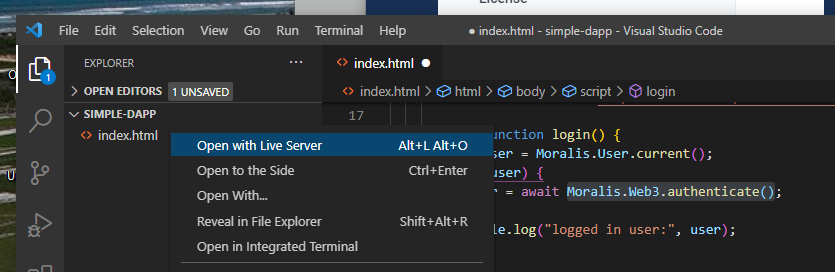
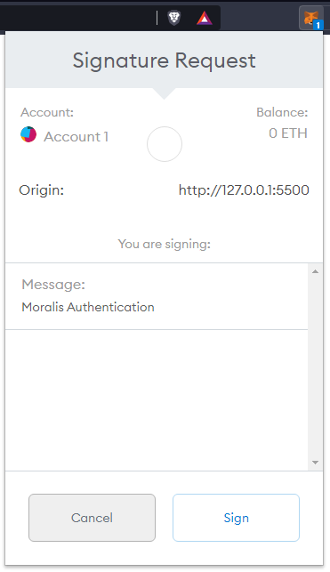
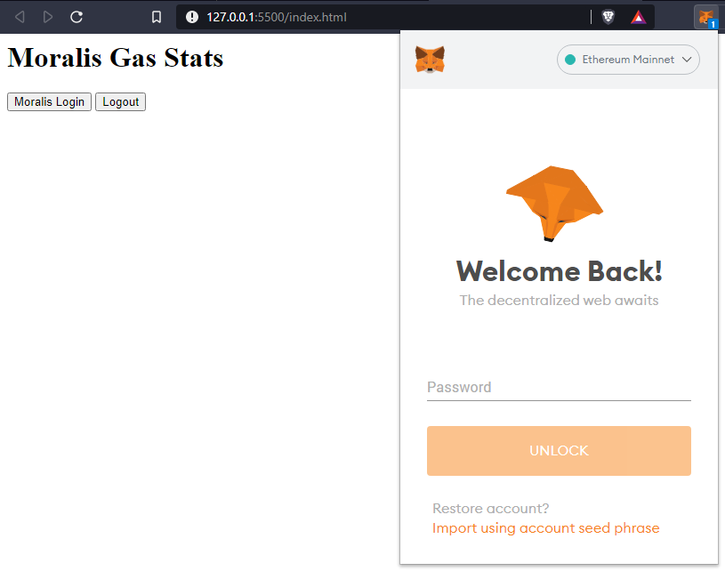
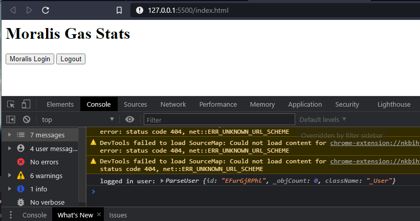

# Build a Simple dApp in 3 Minutes - Login (Part 2)

## How to Login with MetaMask

Install [MetaMask](https://metamask.io) if you haven't already. Add the following code to the `<script>` tag below the Moralis init code.

```markup
    <script>
      // connect to Moralis server
      const serverUrl = "https://xxxxx/server";
      const appId = "YOUR_APP_ID";
      Moralis.start({ serverUrl, appId });

      // add from here down
      async function login() {
        let user = Moralis.User.current();
        if (!user) {
          user = await Moralis.authenticate();
        }
        console.log("logged in user:", user);
      }

      async function logOut() {
        await Moralis.User.logOut();
        console.log("logged out");
      }

      document.getElementById("btn-login").onclick = login;
      document.getElementById("btn-logout").onclick = logOut;
    </script>
```

### Run dApp on Localhost

Run `index.html` on `localhost` as a web page. The easiest way is by using the [live server extension](https://marketplace.visualstudio.com/items?itemName=ritwickdey.LiveServer)  Visual Studio Code. Just right click on `index.html` and select `Open with Live Server`.



### Click Login

You will see a page like the following. Clicking the `Moralis Login` button will call `Moralis.authenticate()` and prompt the user to connect MetaMask.





Open the JavaScript console by pressing `F12` . You should see a message like the following. Congratulations, your dApp has it's first user!



### Logging Out

Pressing the `Logout` button will call `Moralis.User.logOut()` . It's that easy.

### Wow!

Wowww! Congratulations! You have a login working! Keep the pamp going...


[build-a-simple-dapp-in-3-mins-historical-transactions-part3.md](build-a-simple-dapp-in-3-mins-historical-transactions-part3.md)


