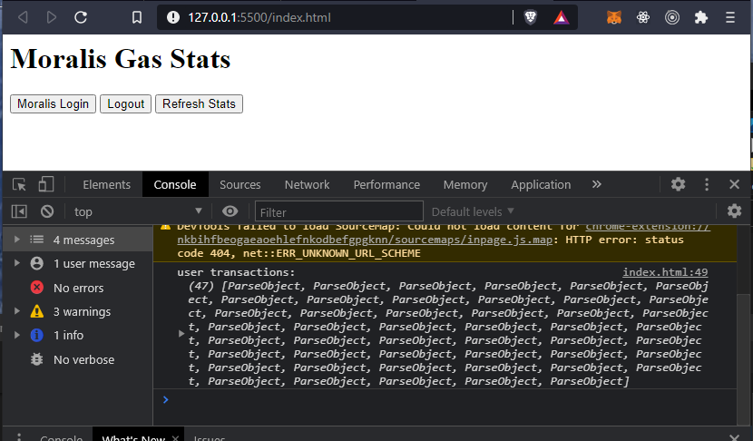

# Build a Simple dApp in 3 Mins - Historical Transactions (Part 3)

## How to Get Historical Data

Getting the past transactions for the logged-in user is as simple as creating a query on the `EthTransactions` table.

```javascript
const user = Moralis.User.current();

const query = new Moralis.Query("EthTransactions");
query.equalTo("from_address", user.get("ethAddress"));
const results = await query.find();
```

### Add a New Button

Add a new button to the HTML body beneath the other ones. You can use this to manually get the stats.

```markup
<button id="btn-get-stats">Refresh Stats</button>
```

### Create a Query and Call It

Add the following code to the `<script>` tag under the previous code.

```javascript
document.getElementById("btn-get-stats").onclick = getStats;

function getStats() {
  const user = Moralis.User.current();
  if (user) {
    getUserTransactions(user);
  }
}

async function getUserTransactions(user) {
  // create query
  const query = new Moralis.Query("EthTransactions");
  query.equalTo("from_address", user.get("ethAddress"));

  // run query
  const results = await query.find();
  console.log("user transactions:", results);
}

// get stats on page load
getStats();
```

And call `getStats()` from the `login()` function like so:

```javascript
async function login() {
  let user = Moralis.User.current();
  if (!user) {
    user = await Moralis.Web3.authenticate();
  }
  console.log("logged in user:", user);

  // ** add this **
  getStats();
}
```

### Check the Results

Save the changes. The dApp page should be updated automatically. You'll see something like this in the console:



### Code So Far

```markup
<html>
  <head>
    <!-- Moralis SDK code -->
    <script src="https://cdn.jsdelivr.net/npm/web3@latest/dist/web3.min.js"></script>
    <script src="https://unpkg.com/moralis/dist/moralis.js"></script>
  </head>
  <body>
    <h1>Moralis Gas Stats</h1>

    <button id="btn-login">Moralis Login</button>
    <button id="btn-logout">Logout</button>
    <button id="btn-get-stats">Refresh Stats</button>

    <script>
      // connect to Moralis server
      const serverUrl = "https://9c8nrl6lfq8u.moralis.io:2053/server";
      const appId = "TCDv7lnGwNN7RIhlj30wA69dnaamxtsmqcTnm3ch";
      Moralis.start({ serverUrl, appId });

      async function login() {
        let user = Moralis.User.current();
        if (!user) {
          user = await Moralis.Web3.authenticate();
        }
        console.log("logged in user:", user);
        getStats();
      }

      async function logOut() {
        await Moralis.User.logOut();
        console.log("logged out");
      }

      // bind button click handlers
      document.getElementById("btn-login").onclick = login;
      document.getElementById("btn-logout").onclick = logOut;
      document.getElementById("btn-get-stats").onclick = getStats;

      function getStats() {
        const user = Moralis.User.current();
        if (user) {
          getUserTransactions(user);
        }
      }

      async function getUserTransactions(user) {
        // create query
        const query = new Moralis.Query("EthTransactions");
        query.equalTo("from_address", user.get("ethAddress"));

        // run query
        const results = await query.find();
        console.log("user transactions:", results);
      }

      //get stats on page load
      getStats();
    </script>
  </body>
</html>
```

### OMG!

Historical working! Yeaaaa... keep going!


[build-a-simple-dapp-in-3-mins-real-time-transactions-part-4.md](build-a-simple-dapp-in-3-mins-real-time-transactions-part-4.md)

