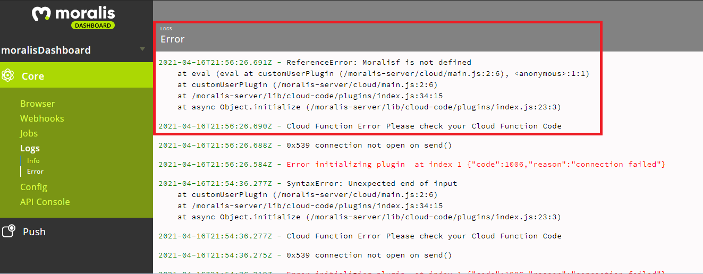

# Troubleshooting

## Check Error Logs in the Dashboard

For any Moralis issue, the first place to check is the logs section in the dashboard.

## Uncaught (in promise) Error: Non-Ethereum Enabled Browser

* Make sure [MetaMask](https://metamask.io) or another Web3 wallet extension is installed in your browser.
* Using Moralis requires your app to be hosted in a web server on `localhost` or some other public domain. If you try to run an HTML file directly from the disk Moralis is unable to communicate with your app as it can't connect to your file directly.
  * The easiest way to do this is with the "[Live Server](https://marketplace.visualstudio.com/items?itemName=ritwickdey.LiveServer)" extension in the [Visual Studio Code](https://code.visualstudio.com) editor (or look for a similar extension for your editor of choice).
  * Another option is using [Python's built-in web server](https://wtmatter.com/python-simple-http-server/).

## Events and Transactions Not Showing Up.

* Ensure that the Moralis server is pointing to the correct network.
* Check that the event topic is correctly defined.
  * **`EventName(type1,type2,type3)`**
  * There should be no spaces between commas, no event param names only types.
* Was the event **ABI **included, and properly formatted?
* Ensure that the event sync is pointing to the correct contract address.
* Ensure that the Moralis server is updated to the latest version.
* **Switching the local devchain** from Ganache to Hardhat (or vise versa) may result in a corrupted server instance. If you want to switch from one to the other, it's better to create a new server instance.
* Are you** forking the mainnet**? This feature in both Ganache-CLI and Hardhat is not yet supported.

See the [Real-Time Transactions](../moralis-server/automatic-transaction-sync/smart-contract-events.md) docs for more details on how to set up the plugin.

## CORS Errors in the Client

Check for syntax errors in your cloud functions.

## The Dashboard Page is Blank when Opening it

Check for syntax errors in your cloud functions.

## Getting Errors when Trying to Run "npm install moralis" on Linux

Try installing the package "libudev-dev" and re-run the install script.


