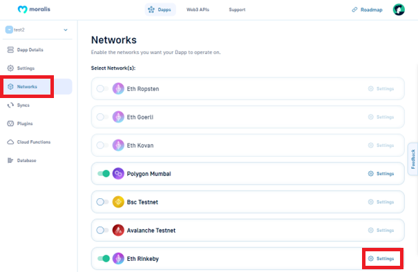
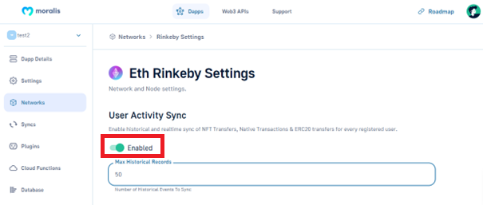

# User Balances and Transactions

## Sync and Watch Address

### Defining

You can get all historical transactions and listen to new transactions in real-time. It requires the following information:

* `ChainId` (required): The chain to sync
* `Address` (required): The address you will listen to for this event.
* `Sync_historical` (optional): Sync Historical Data option. Default value `true`


<br>


### Historical Event Limit

If a sync job is created that would result in retrieving 500k or more historical events, then the `"Sync_historical (Optional)`option will be disabled and no historical data will be saved. It is possible to contact support to upgrade your account to enable saving it anyway but think hard about whether it's actually necessary before doing so. It's possible to handle the events in real-time without saving the data to the database.

## Monitoring Authenticated Users

Moralis Server syncs all transactions and balances for users that at some point authenticated with your app in real-time. You don't have to do anything to enable this feature as it's enabled by default in all Moralis Servers.

As always we want you to focus on the user experience and leave this mundane and complex task of syncing blockchain data to us [🧙](https://emojipedia.org/mage/).

Moralis Server will in real-time insert and update data into your database so that you can get all the latest transactions and balances of your users with a simple database query.


In this video we demonstrate this functionality.


## Monitoring Non-Authenticated Address

By default, only the transaction data for registered users will appear in the `EthTransactions` collection. To watch a specific address- like a centralized exchange hot wallet- add a new `Sync and Watch Address` plugin, enter the `Address` and then click the "Add Plugin" button.

This starts a sync job and adds an entry to the `WatchedXxxAddress` collection, where "Xxx" is one of the chain names defined [here](historical-transactions.md#chain-prefixes). Once the transactions are synced, they can be queried like any other transactions, including [Live Queries](../database/live-queries.md).

```javascript
const web3 = new Moralis.Web3();
const binanceWallet = "0x...";

// create query
const query = new Moralis.Query("EthTransactions");
query.equalTo("to_address", binanceWallet);

// subscribe for real-time updates
const subscription = await query.subscribe();
subscription.on("create", function (data) {
  const amountEth = web3.utils.fromWei(data.attributes.value);
  console.log(`${amountEth} deposited to Binance`);
});
```

Note: on a new Nitro server the subscription will be on update instead of create

Note: the table name in latest version of the server will be `_AddressSyncStatus` instead of `WatchedXxxAddress`

Keep in mind that watching an address with a lot of transaction volume will result in a lot of data being stored if the `Sync_historical` option is enabled.

See the [Cloud Functions](../cloud-code/cloud-functions.md) and [Live Query](../database/live-queries.md) sections for more details on these topics.

### Historical Transaction Limit

If an address is watched that would result in retrieving 500k or more historical transactions, then the `Sync_historical` option will be disabled and no historical data will be saved. It is possible to contact support to upgrade your account to enable saving it anyway but think hard about whether it's actually necessary before doing so. It's possible to handle new transactions in real-time without saving the data to the database. You can also call the [Deep Index API](../../moralis-server/automatic-transaction-sync/broken-reference/) to selectively query the historical data. See below for more details.

### Watch Address From Code

The `Sync and Watch Address` plugin calls a [Cloud Function](../cloud-code/cloud-functions.md) called `watchXxxAddress`under the hood, where "Xxx" are the chain names [here](historical-transactions.md#chain-prefixes). These cloud functions can also be called directly from your own code!

```javascript
const results = await Moralis.Cloud.run("watchBscAddress", {
  address: "0x...",
});
```

By default, only new transactions made by addresses being watched by using this cloud function will be added to the database. If you also want to add historical data for addresses that you want to watch, you can add `sync_historical:true`:

```javascript
const results = await Moralis.Cloud.run("watchBscAddress", {
  address: "0x...",
  sync_historical: true,
});
```


The watch address functions return no value as they start a job. They are still asynchronous though! Once the promise returns the synced transactions, they should be in the XxxTransactions table for the corresponding chain.


### Unwatch Address From Code

When deleting `Sync and Watch Address` plugin on certain address, the plugin calls a [Cloud Function](../cloud-code/cloud-functions.md) called `unwatchXxxAddress` under the hood, where "Xxx" are the chain names [here](historical-transactions.md#chain-prefixes). Similarly to watching address from code, this cloud function can also be called directly from your own code!

```javascript
const results = await Moralis.Cloud.run("unwatchBscAddress", {
  address: "0x...",
});
```

## Unconfirmed Transactions

Transactions on Testnet and Mainnet can take a while to be confirmed. When Moralis detects a new transaction (or event) in an unconfirmed state, these get put into transaction tables like `EthTransactions` with `confirmed: false`. When the transaction gets confirmed, the status is updated to `confirmed: true`.

It is important to note that different blockchains will have different confirmation numbers to ensure the validity of transactions. This means that in order for transactions to change its `confirmed` value in DB to `true`, it will require certain number of confirmations:

* Ethereum: 12
* Polygon: 100
* BSC: 18
* Avalanche: 100
* Fantom: 100

### Consequences for Triggers

This means if you define an `afterSave` trigger on a collection with a `confirmed` property like `EthTransactions` or any "Sync and Watch Contract Event" collection, then the trigger can get fired TWICE- once for `confirmed: false` and again for `confirmed: true`! See the [Trigger](../cloud-code/triggers.md) section for more details.

## Disabling User Historic Sync

By default Moralis will sync all the past transactions of your users automatically. This is very resource intensive and CPU and RAM may be a bottleneck here. Imagine you have 5000 users and all of them have a history of 100 transactions - suddenly your server needs to handle 500,000 historic events which will eat up CPU and RAM resources quickly especially if you have many new users joining at the same time.

If you know that you don't need all history of all your users you should disable historic sync in Server Settings. See image below.


<br>


### Fetching historical data via API

Please remember that disabling historic sync only means that your database won't be filled with historical events.

You can still get all historic data using the [Web3 API functions](../web3-api/). Web3 API are completely independent from the contents of your database.

Therefore please check out the features of the Web3 API and if the historical endpoints in the Web3 API are enough for your use-case then you should disable historic sync in your server as you won't use it.

### When should you not disable historic sync?

In case you need to run some specific queries that the Web3 API doesn't offer you need to have historic sync enabled so that you can run custom queries on the historical data using the [Database Queries](../database/queries.md) Moralis offers.

### Smart Contract Historical Events Will Still Work

Please keep in mind that this setting just disables the automatic fetching of user history. If you have added [Smart Contract Events](smart-contract-events.md) - they will still fetch history and put that info into your database as they work independently of this setting.

Below we explain a concrete example of how a Smart Contract Event can replace the historic sync of user data.

## Optimisation examples

In this section we will give concrete optimisation examples that can save you a lot of CPU and RAM usage.

### History and activity related only to your contract

Let's say you have an NFT contract and you only care about the user history and user real-time transactions that are related to that contract.

In this case you should disable historic sync as explained above and instead just add a smart [contract event sync](historical-transactions.md#sync-and-watch-address) for your NFT token contract. This way you will only be keeping history and watching real time transactions for your smart contract and nothing else.

## Collection Schema

Moralis Server will get all value transfers, token transfers (ERC20), and NFT transfers (ERC721, ERC1155) made from or to any authenticated user address (including linked addresses) or watched address. Right after a user is [created](../users/) (or an address is watched), Moralis Server will populate the following set of collections for each blockchain synced by the Moralis Server. The names will be prefixed by the chain they came from.

* xxxTransactions
* xxxTokenTransfers
* xxxTokenBalances
* xxxNFTTransfers
* xxxNFTOwners

These collections can be viewed in the "Moralis Dashboard."

### Chain Prefixes

| Chain                                                    | Prefix  |
| -------------------------------------------------------- | ------- |
| Ethereum Mainnet, Ropsten, Georli, Kovan, Local Devchain | `Eth`   |
| Binance Smart Chain Mainnet, Testnet                     | `Bsc`   |
| Polygon (Matic) Mainnet, Mumbai Testnet                  | `Matic` |
| Elrond                                                   | `Erd`   |

### Transactions

All transactions to or from a user or watched addresses on that chain does not include internal transfers within smart contracts, like token transfers.

```javascript
{
    "objectId": String,
    "block_hash": String,
    "gas_price": Number,
    "block_timestamp": Date,
    "receipt_cumulative_gas_used": Number,
    "ACL": ACL,
    "receipt_gas_used": Number,
    "input": String,
    "receipt_contract_address": String,
    "hash": String,
    "updatedAt": Date,
    "nonce": Number,
    "to_address": String,
    "transaction_index": Number,
    "value": String,
    "gas": Number,
    "receipt_status": Number,
    "createdAt": Date,
    "block_number": Number,
    "from_address": String,
    "confirmed": Boolean,
}
```

### TokenTransfers

All ERC20 token transfer events for user addresses and watched addresses will be found here.

```javascript
{
    "objectId": String,
    "block_hash": String,
    "block_timestamp": Date,
    "ACL": ACL,
    "updatedAt": Date,
    "token_address": String,
    "transaction_hash": String,
    "to_address": String,
    "transaction_index": Number,
    "value": String,
    "log_index": Number,
    "createdAt": Date,
    "block_number": Number,
    "from_address": String,
    "confirmed": Boolean,
}
```

### TokenBalances

A summary of a user and watched address token balances. This will be updated in real-time as new transactions are made.

```javascript
{
  "objectId": String,
  "decimals": String,
  "contract_type": String,
  "ACL": ACL,
  "name": String,
  "updatedAt": Date,
  "token_address": String,
  "address": String,
  "symbol": String,
  "createdAt": Date,
  "block_number": Number,
  "balance": String,
}
```

### NFTTransfers

Transfer events for NFTs (ERC721 and ERC1155 tokens) of user and watched addresses.

```javascript
{
  "objectId": String,
  "block_hash": String,
  "token_id": String,
  "block_timestamp": Date,
  "contract_type": String,
  "ACL": ACL,
  "updatedAt": Date,
  "token_address": String,
  "transaction_hash": String,
  "to_address": String,
  "transaction_index": Number,
  "log_index": Number,
  "amount": String,
  "createdAt": Date,
  "block_number": Number,
  "transaction_type": String,
  "from_address": String,
  "confirmed": Boolean,
}
```

### NFTOwners

A summary of NFT balances (ERC721 and ERC1155 tokens) for a user and watched addresses.

```javascript
{
  "objectId": String,
  "token_id": String,
  "owner_of": String,
  "token_uri": String,
  "contract_type": String,
  "ACL": ACL,
  "name": String,
  "updatedAt": Date,
  "token_address": String,
  "amount": Sring,
  "symbol": String,
  "createdAt": Date,
  "block_number": Number,
}
```
