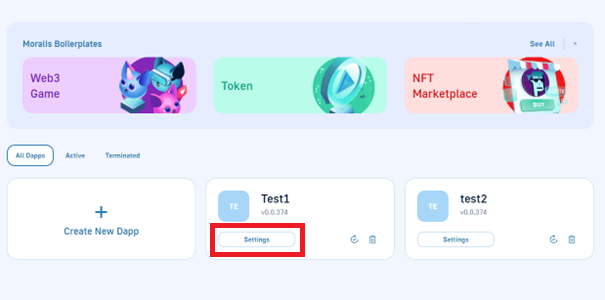
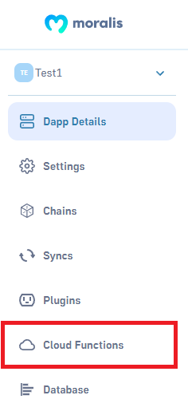

# Cloud Functions

## Define Cloud Functions


Follow the tutorial for an introduction to Cloud Functions: [**Tutorial**](cloud-functions.md#tutorial)


<mark style="color:green;">**For complex apps, sometimes you need a bit of logic that isn’t running on a mobile device. Cloud Code makes this possible.**</mark>

Cloud Code is easy to use because it’s built on the same Moralis JavaScript SDK that powers thousands of apps. The only difference is that this code runs in your Moralis Dapp rather than running on the user’s mobile device. When you update your Cloud Code, it becomes available to all mobile environments instantly. You don’t have to wait for a new release of your application. This lets you change app behaviour on the fly and add new features faster.

Even if you’re only familiar with mobile development, we hope you’ll find Cloud Code straightforward and easy to use.


**Note:** Starting June 2022 you can only write Cloud Function code through CLI/IDE [**(setup)**](cloud-functions.md#ide-setup)**.**


<p align="center">
  
</p>

<p align="center">
  
</p>

Let’s look at a slightly more complex example where Cloud Code is useful. One reason to do the computation in the cloud is so that you don’t have to send a huge list of objects down to a device if you only want a little bit of information.

For example, let’s say you’re writing an app that lets people review movies. A single `Review` object could look like this:

```javascript
{
  "movie": "The Matrix",
  "stars": 5,
  "comment": "Too bad they never made any sequels."
}
```

If you wanted to find the average number of stars for The Matrix, you could query for all of the reviews, and the average amount of stars on the device. However, this uses a lot of bandwidth when you only need a single number. With Cloud Code, we can just pass up the name of the movie, and return the average star rating.

Cloud Functions accept a JSON parameters dictionary on the `request` object, so we can use that to pass up the movie name. The entire Moralis JavaScript SDK is available in the cloud environment, so we can use that to query over `Review` objects. Together, the code to implement `averageStars` looks like this:



```javascript
Moralis.Cloud.define("averageStars", async (request) => {
  const query = new Moralis.Query("Review");
  query.equalTo("movie", request.params.movie);
  const results = await query.find();
  let sum = 0;
  for (let i = 0; i < results.length; ++i) {
    sum += results[i].get("stars");
  }
  return sum / results.length;
});
```



The only difference between using `averageStars` and `hello` is that we have to provide the parameter that will be accessed in `request.params.movie` when we call the Cloud Function. Read on to learn more about how Cloud Functions can be called.

### Global Packages

The following packages are available globally within Cloud Function code and can be used without a `require` statement.

- `crypto` ([docs](https://nodejs.org/api/crypto.html))

### ⚠️ IMPORTANT - Don't create any global variable

Cloud Functions cannot have state. They can read and write data to the database but you can't create global variables like in the example below.



```javascript
let name = "Satoshi"; // NOT ALLOWED

Moralis.Cloud.define("functionName", async (request) => {
  let age = 20; // allowed
});
```



The reason is that your cloud code will get load balanced across many instances of your server so that Moralis can infinitely scale your app.


**Note**: The different instances of your server won't share any variables defined outside the function bodies.


All instances of your server will share the same database. Therefore if you need to share data across instances it's recommended you store it in the [database](../database/).

#### What happens if I create global variables?

You will get unexpected results. Consider the example below.



```javascript
let count = 0; // very bad

Moralis.Cloud.define("increment", async (request) => {
  logger.info(count);
  count++;
});

// If you call the function above you may get the following results
// 0
// 0
// 0
// 1
// 1
// 2
// 1
// 3
// 0
// 2
```



#### Why is the increment function not working properly?

Because each time the request gets randomly routed to different instances of your server and each instance has its own separate `count` variable.

<mark style="color:green;">**Therefore we hope you now understand why you should not use global variables**</mark> 🙌

#### What about global constants?

Global constants are ok to use as they will just be copied to all instances and won't change.

## IDE Setup


You can find instructions specifically for your server in the server's settings in the Cloud Functions tab


You can write your Cloud Functions in your preferred IDE by making use of the `moralis-admin-cli`.

To get started, you need to install it by running the following code in the terminal:

```bash
npm install -g moralis-admin-cli
```

After you have installed the Moralis Admin CLI, you can head to the admin panel and open up the Cloud Functions on the server you want to work on.

In the lower part of the modal, there will be a code snippet that you need to run in the terminal.

The only thing you need to change is the path to the local JavaScript folder on your computer that contains the Cloud Functions.

```javascript
moralis-admin-cli watch-cloud-folder --moralisApiKey your_api_key --moralisApiSecret your_api_secret --moralisSubdomain subdomain.moralis.io --autoSave 1 --moralisCloudfolder /path/to/cloud/folder
```

After you've run the command, the cloud code will be updated automatically on the backend with each save!


Legacy UI is present in the video, some things might be different



Exact time-stamp where we explain how to setup an IDE on your local machine.


## Debugging

For debugging or informational purposes it's often useful to print messages. A logger can be obtained for this purpose. It will print messages to the Moralis Dashboard in the "Logs > Info" section.



```javascript
const logger = Moralis.Cloud.getLogger();
logger.info("Hello World");
```



#### Printing Logs in Real-Time in the Console

```shell
moralis-admin-cli get-logs --moralisApiKey MORALIS_CLI_API_KEY --moralisApiSecret MORALIS_CLI_SECRET_KEY
```

To learn more about CLI, how to install CLI and how to work with CLI please check the CLI docs using the link below.


[moralis-admin-cli.md](../tools/moralis-admin-cli.md)



Legacy UI is present in the video, some things might be different



Video explaining how to use the CLI in order to get logs in real-time.


## Call Cloud Functions





```javascript
const params = { movie: "The Matrix" };
const ratings = await Moralis.Cloud.run("averageStars", params);
// ratings should be 4.5
```







```javascript
import { useMoralisCloudFunction } from "react-moralis";

function App() {
  const { fetch } = useMoralisCloudFunction(
    "averageStars",
    { movie: "The Moralis" },
    { autoFetch: false }
  );

  const cloudCall = () => {
    fetch({
      onSuccess: (data) => console.log(data), // ratings should be 4.5
    });
  };

  return <button onClick={cloudCall}>Make Cloud Call</button>;
}

export default App;
```





In general, two arguments will be passed into Cloud Functions:

1. **`request`** - The request object contains information about the request. The following fields are set:
2. **`params`** - The parameters object is sent to the function by the client.
3. **`user`** - The `Moralis.User` that is making the request. This will not be set if there was no logged-in user.

If the function is successful, the response in the client looks like this:

```javascript
{ "result": 4.8 }
```

If there is an error, the response in the client looks like this:

```javascript
{
  "code": 141,
  "error": "movie lookup failed"
}
```

## Call via REST API

Cloud Functions can be called directly using a simple GET request. Add your Moralis App Id and any Cloud Function arguments as query parameters to your Moralis server URL. Say you had the following Cloud Function:



```javascript
Moralis.Cloud.define("Hello", (request) => {
  return `Hello ${request.params.name}! Cloud functions are cool!`;
});
```



Then the URL would look something like the following:

```shell
https://1a2b3c4c5d6f.moralis.io:2053/server/functions/Hello?_ApplicationId=1a2b3c4c5d6f1a2b3c4c5d6f&name=CryptoChad
```

The URL has the following structure:

1. Full Moralis server url.
2. `/functions/`.
3. Cloud Function Name.
4. `?_ApplicationId=yourMoralisAppId`.
5. (optional) Cloud Function param key/value pairs: `&param1=value&param2=value`.

## Master Key in Cloud Code <a href="#using-the-master-key-in-cloud-code" id="using-the-master-key-in-cloud-code"></a>

Set `useMasterKey:true` in the requests that require the master key.

#### Examples: <a href="#examples-3" id="examples-3"></a>



```javascript
query.find({ useMasterKey: true });
object.save(null, { useMasterKey: true });
Moralis.Object.saveAll(objects, { useMasterKey: true });
```




**Note:** The master key is accessible by default in a cloud function when you use `useMasterKey:true`



**Important**: The master key should not be used on your frontend code as it would be accessible in the user's browser.


In case if you are using master key from another backend server that you are controlling you can use the following code to intialize the master key:



```javascript
const Moralis = require("moralis/node"); // Node.js
const appId = "YOUR_MORALIS_APP_ID";
const serverUrl = "YOUR_MORALIS_SERVER_URL";
const masterKey = "YOUR_MORALIS_MASTER_KEY";

Moralis.start({ serverUrl, appId, masterKey });
```



## Cloud Function Validation

It’s important to make sure the parameters required for a Cloud Function are provided and are in the necessary format. you can specify a validator function or object which will be called prior to your Cloud Function.

Let’s take a look at the `averageStars` example. If you wanted to make sure that `request.params.movie` is provided, and that `averageStars` can only be called by logged-in users, you could add a validator object to the function.



```javascript
Moralis.Cloud.define(
  "averageStars",
  async (request) => {
    const query = new Moralis.Query("Review");
    query.equalTo("movie", request.params.movie);
    const results = await query.find();
    let sum = 0;
    for (let i = 0; i < results.length; ++i) {
      sum += results[i].get("stars");
    }
    return sum / results.length;
  },
  {
    fields: ["movie"],
    requireUser: true,
  }
);
```



If the rules specified in the validator object aren’t met, the Cloud Function won’t run. This means that you can confidently build your function, knowing that `request.params.movie` is defined, as well as `request.user`.

## Advanced Cloud Function Validation

Often, not only is it important that `request.params.movie` is defined, but also that it's the correct data type. You can do this by providing an `Object` to the `fields` parameter in the "Validator."



```javascript
Moralis.Cloud.define(
  "averageStars",
  async (request) => {
    const query = new Moralis.Query("Review");
    query.equalTo("movie", request.params.movie);
    const results = await query.find();
    let sum = 0;
    for (let i = 0; i < results.length; ++i) {
      sum += results[i].get("stars");
    }
    return sum / results.length;
  },
  {
    fields: {
      movie: {
        required: true,
        type: String,
        options: (val) => {
          return val.length < 20;
        },
        error: "Movie must be less than 20 characters",
      },
    },
    requireUserKeys: {
      accType: {
        options: "reviewer",
        error: "Only reviewers can get average stars",
      },
    },
  }
);
```



This function will only run if:

- `request.params.movie` is defined.
- `request.params.movie` is a String.
- `request.params.movie` is less than 20 characters.
- `request.user` is defined.
- `request.user.get('accType')` is defined.
- `request.user.get('accType')` is equal to ‘reviewer.’

The full range of built-in validation options are:

- `requireMaster`: Whether the function requires a `masterKey` to run.
- `requireUser`: Whether the function requires a `request.user` to run.
- `validateMasterKey`: Whether the validator should run on `masterKey` (defaults to false).
- `fields`: An `Array` or `Object` of fields that are required on the request.
- `requireUserKeys`: An `Array` of fields to be validated on `request.user`.

The full range of built-in validation options on `.fields` are:

- `type`: The type of the `request.params[field]` or `request.object.get(field)`.
- `default`: What the field should default to if it’s `null`.
- `required`: Whether the field is required.
- `options`: A singular option, an array of options, or a custom function of allowed values for the field.
- `constant`: Whether the field is immutable.
- `error`: A custom error message if validation fails.

You can also pass a function to the Validator. This can help you apply reoccurring logic to your Cloud Code.



```javascript
const validationRules = (request) => {
  if (request.master) {
    return;
  }
  if (!request.user || request.user.id !== "masterUser") {
    throw "Unauthorized";
  }
};

Moralis.Cloud.define(
  "adminFunction",
  (request) => {
    // do admin code here, confident that request.user.id is masterUser, or masterKey is provided
  },
  validationRules
);

Moralis.Cloud.define(
  "adminFunctionTwo",
  (request) => {
    // do admin code here, confident that request.user.id is masterUser, or masterKey is provided
  },
  validationRules
);
```



#### SOME CONSIDERATIONS TO BE AWARE OF

- The validation function will run prior to your Cloud Code Functions. You can use `async` and promises here, but try to keep the validation as simple and fast as possible so your cloud requests resolve quickly.
- As previously mentioned, cloud validator objects will not validate if a master key is provided, unless `validateMasterKey:true` is set. However, if you set your validator to a function, the function will **always** run.

## Units

Moralis units are available inside your cloud functions.\
In order to successfully run the `units` function you always need to specify a `method` and a `value`.

#### To wei

Convert any ether value to wei.



```javascript
const result = await Moralis.Cloud.units({
  method: "toWei",
  value: 1,
});
return result;
```



<mark style="color:green;">**Result**</mark>: `1000000000000000000`

#### From wei

Convert any wei value to ether.



```javascript
const result = Moralis.Cloud.units({
  method: "fromWei",
  value: 1000000000000000,
});
return result;
```



<mark style="color:green;">**Result**</mark>: `0.001`

#### To hex

Convert any given value to its hexadecimal representation.



```javascript
const result = Moralis.Cloud.units({
  method: "toHex",
  value: 100,
});
return result;
```



<mark style="color:green;">**Result**</mark>: `64`

#### Using decimals

Convert any given value using a custom decimals value.



```javascript
result = Moralis.Cloud.units({
  method: "fromWei",
  value: 10000000000000,
  decimals: 10,
});
return result;
```



<mark style="color:green;">**Result**</mark>: `1000`

## Web3

Web3 functions are available within Cloud Code including the ability to call contract methods. Moralis uses the [Web3.js](https://web3js.readthedocs.io) library.


### Example of how to use a custom RPC url



```javascript
Moralis.Cloud.define("run_contract_function_with_web3", async (request) => {
  web3 = new Moralis.Web3(
    new Moralis.Web3.providers.HttpProvider(
      "https://speedy-nodes-nyc.moralis.io/YOUR_ID_HERE/bsc/mainnet"
    )
  );
  const abi = [
    {
      constant: true,
      inputs: [],
      name: "name",
      outputs: [{ name: "", type: "string" }],
      payable: false,
      stateMutability: "view",
      type: "function",
    },
  ];
  address = "0x2170Ed0880ac9A755fd29B2688956BD959F933F8";
  const contract = new web3.eth.Contract(abi, address);
  const name = await contract.methods
    .name()
    .call()
    .catch((e) => logger.error(`callName: ${e}${JSON.stringify(e, null, 2)}`));
  return name;
});
```




### Contracts

Once you have a `web3` instance, you can use it to make contract calls by constructing a contract instance with the ABI and contract address.

```javascript
const contract = new web3.eth.Contract(abi, address);
```

For convenience, Moralis bundles the [Openzepplin](https://github.com/OpenZeppelin/openzeppelin-contracts/tree/master/contracts/token) ABI for ERC20, ERC721, and ERC1155.

- `Moralis.Web3.abis.erc20`
- `Moralis.Web3.abis.erc721`
- `Moralis.Web3.abis.erc1155`


Bringing it all together...



```javascript
const web3 = new Moralis.Web3(
    new Moralis.Web3.providers.HttpProvider(
      "https://speedy-nodes-nyc.moralis.io/YOUR_ID_HERE/bsc/mainnet"
    )
  );
const abi = Moralis.Web3.abis.erc20;
const address = "0x....";

// create contract instance
const contract = new web3.eth.Contract(abi, address);

// get contract name
const name = await contract.methods
  .name()
  .call()
  .catch(() => "");
```




For more details on the Web3.js contract interface, see the [`web3.eth.Contract`](https://web3js.readthedocs.io/en/v1.3.4/web3-eth-contract.html) section of the Web3.js docs.



### Contract ABI

To find the ABI for a contract already published on Ethereum's Mainnet you can look on [Etherscan](https://etherscan.io) by searching for the contract address and looking in the "Contract" tab. There are similar block explorers for other chains where the ABI is published. For instance, you can go to [BscScan](https://www.bscscan.com) for Binance Smart Chain.

For your own contracts, the ABI can be found in the build directory after compiling the contract

- Truffle: `/truffle/build/contracts/myContract.json`.
- Hardhat: `/artifacts/contracts/myContract.sol/myContract.json`.


## IPFS

IPFS functionality is available inside your cloud functions. In order to successfully upload to IPFS you need to specify:

- A source type: `sourceType`
- A source: `source`

Below are the supported values of `sourceType`

### Url

Push the content of a given URL to IPFS.



```javascript
const result = await Moralis.Cloud.toIpfs({
  sourceType: "url",
  source:
    "https://moralis.io/wp-content/uploads/2021/06/Moralis-Glass-Favicon.svg",
});
return result;
```



<mark style="color:green;">**Result**</mark>: `{ "path": "https://ipfs.moralis.io:2053/ipfs/QmYrUVhr1f6ZpZ4jrmi7mSv5X8MGjxxrgaERWde3cFASL6" }`

### String

Push a string to IPFS.



```javascript
const result = await Moralis.Cloud.toIpfs({
  sourceType: "string",
  source: "Moralis rules <3",
});
return result;
```



<mark style="color:green;">**Result**</mark>: `{ "path": "https://ipfs.moralis.io:2053/ipfs/QmeYY26fCN4t2Apo9Nqix5ZDhJwcjoyDVLLz85TLkoiqpn" }`

### Object

Push an object to IPFS.



```javascript
const result = await Moralis.Cloud.toIpfs({
  sourceType: "object",
  source: {
    type: "Monster",
    lp: 100,
    spells: {
      base: ["spell one", "spell two"],
      locked: ["spell three"],
    },
  },
});
return result;
```



<mark style="color:green;">**Result**</mark>: `{ "path": "https://ipfs.moralis.io:2053/ipfs/QmWowsJ74rYCHUYhag83Puky1qZTSsdj3n7bT2ejE2NvCJ" }`

### Base64 Binary

Push a base64 file to IPFS.



```javascript
const result = await Moralis.Cloud.toIpfs({
  sourceType: "base64Binary",
  source:
    "/9j/4AAQSkZJRgABAQAAAQABAAD/2wCEAAoGCBETExcTEhETGBcYFxkaGBkZGRkZGRcZGBcZGBcaGBUaISsjGh0oHxkaJDUkKCwuMjIyGSM3PDcxOysxMi4BCwsLDw4PHRERHTMmISgxMTs0OzsxMzUzLjIzMzM5LjYxOzExMTM7NjEzMS4xOzEzMTEzMTExMTEuMTExMTExO//AABEIAPYAzQMBIgACEQEDEQH/xAAcAAEAAQUBAQAAAAAAAAAAAAAABwIDBAUGCAH/xABQEAABAwIDBAYGBwUDBg8AAAABAAIDBBEFEiEGMUFhBxMiUXGBFDJScpGhCCNCYoKxsjOSosHRU8LhJEOTo7PwFRYXJTQ1VGNkc3TD0tPx/8QAGgEBAAIDAQAAAAAAAAAAAAAAAAQFAQIDBv/EAC0RAAICAgAEBQMDBQAAAAAAAAABAgMEEQUSITEyQVFhcRMikTOBsRQVI8HR/9oADAMBAAIRAxEAPwCZkREAREQBERAEREAWPXVccLHSSyNYxou5ziAGjmSshQztXXOxiqdGJHNoKd+XsmxqJW+sQfZG4Hu3anQDJx3pSqJ3mHB6Zz+HWuaT36tj3NHcXn8K0Muze0FWc1VXFgO9rpXWHhFEMg8rLr8P6qBgjhY1jBua0WHie88ysj03mgOFj6M6yPtRYgwO3i3WN194L4+i2mou1FVyygcGy9aBbuimH5NXd+m809N5oDkME6YqyF/V19M19iA4tBjkb3ksPZJ5WapW2V2qosQYXU0ocR6zHdl7L+0w8OYuOa4LaPC6asZlmYMwHZkGj2eDuI5HRRPWQ1OG1IySOZIw5mSMNszb6EcjaxaeYN0B6yRcX0XbaMxOEh4DaiMASsG5wO6Rg9k8RwPlftEAREQBERAEREAREQBERAEREAREQBERAch0tY2aPDZXsNpJLRMPEGTRxHMNzHxAUd4O5sMEcTdA1o8ydXHzJJWy+kpVkR0kPBz5JD+ANaP1uXFYZieeNpvrYA+I0KA6303mnpvNc16bzT03mgOl9N5p6bzXNem809N5oDpfTea5npCa2SFr/tRv3/ddoR8Q1ffTea021VfdjYwdScx8Bu+f5IDB2SxyWgqY6mI6sPabewew6OY7kR8DY8F6nwfEI6mGOoiN2SNDmnkRuI4EbiO8LyCp/wDo8YiZKCSBxuYZTlHcyQB4/izoCTUREAREQBERAEREAREQBERAEREAREQEG/STJ6+lHDqpD5l4v+QXG7CbMV1c9wpWtyt9d7yWxtJ3AkAku5AFdr9JVv11If8Au5fk5n9V3Wxhgw7DqSItJkki60sYAXvc4NfIdSBYZmtuSB6o4gICK9q9jsQoIzLKyN8QPakicXBlzYZ2ua1wBvvsRz3X5X03mvS9DiFLiMMsQBI7UU0TxlezM3UObzBuHC4PAry3jNG6CeWBxN45Hxk9+Rxbf5IDZUckkr2xRNc973BrGt1LnHcAFKWDdE8rmB1TV5HkXMcbA7LyMjj2j4C3M71o/o54ax9VPUOFzDG1rLj1XSlwLgeByscPBxUq7Q7QOhk6mFsbnhoc4yPLGtzXyN7LSS42J4WFu9ARXtv0e1lFE6eB4qI2gl9m5JI2je4tuc7RxINx3WuRFsshcS5xuSvUOxu1jK8yxOiMU8JAljJzizr2c11hmabdwPxF4F6U8CbQ4jLFGLRutJGO5j9coHANdmaOTQgOVUvfRrqbTVcV/Wjjfb3HOaT/ABj4qIVJH0d5LYm8e1TSD/WRO/kgPQiIiAIiIAiIgCIiAIiIAiIgCIiAIiICEvpK/tKP3ZvzjWb0g4m6Gmw+qZfq5aZrC4bmuyxvYPMZ/wBxYn0lvXo/dm/OJX9icXo8Qwd2H1hIfC0NaB65F/qXx/eaeyR3DXQrEpKK2+xlJt6RrOi3aguxcAmzJoXRvuQBmja6RriT3Bpb+Jc7tbglXU1tVPDCSx00jmnMwXaXmxsTx3+akLY3YmKBlzbORq8gEnv04Dlu8d67eOngAsI2+YB/NVss9t/40ter8/glrHjFfdvft5Ed9AMUlNLVQzxuY6RkT233Hqy8OAcNL/WN0vfetN0p43JBilSzWx6lzf8AQRg/MKUqnConuJdlykdkBoaWnvzDePLzXIbY7Ex1T8z5HmQNDWvLiTlBNgb30Fz/AFWv9zjD9VaXquqMPGUvC/yanoEqXTYlVSkb6fX/AEkYHyBWv+kZ/wBZRf8ApGf7WZdp0a4dBhTZBIJXSSEZ5MgLMrb5GgNJI3kk8SVFXSrij6rEZZC1zWizIw4WPVsFg7wcczvxKfTkVXLcJJnCdc4eJHKLuugqbLi8LfbZK34Ruf8A3Fwq6/obflxelP3pB+9DIP5rscz06iIgCIiAIiIAiIgCIiAIiIAiIgCIiAhX6Svr0fuzfnEsvYHB4oadjmgFzwHOd3kjX8/gtZ9JKe9RSx+zE9377wP7io6NKySWlJIeBE4MztN9LXF2faAFgfJVnFarLKNVv5+CXhyip/d+xI0c+ltyuCdauKpcAM8Tz95gzNdzHEK4KruhlP4QPmSvI/UuXT/ZZNRNgZzwWHV1DW6uJJO4DVx5AKi879GsbGO9xzHya3T4lXYaZkV3udc/ae46/wCA5Bc5Tb8b37IwtR7FFN1jjdzQ1vAXu7z4DwUR9L8gNW1oaBZl7jjckW+LSfxKWzVPf+xZp7b9G+LW73fJQp0k0c8da/rjfNZzHAWDmHdp3g3B534EK/4LiWxsd046WuhEyrY8vLvqcutxsZiAp66mmLsrWTRl57mZgH/wkrTovTFcezEXHdFG0za+hYXOBmhAjlHG4Fmv/EBfxzDguxQBERAEREAREQBERAEREAREQBEXO7d7Sx4dSvnfYu9WJnF8h3DwG8nuB42CAhTp4xATYm5gNxDGyM92bV5/XbyXYfR4Yw0s5IuRPx3WMbeHkVEEbZ6yosLyTTSebnyO1J7tTfuC9IbE7PxYdTNgjsXetK/+0kI1PgNwHcEArMOfA4uiaXxk3LB60ZO/IOLfu8Fjsr4Tve1p4h3ZI8QV0mdW5GMdq5jSeYB/NUmXwOm+fPF6b7+hKhlNLUls0La5jtIg+Q9zGk/xbh8Vm0GFOe4SVFtNWRDVre4vP23fILah1tAmddMTg1GPLm8T9zE8lyWl0LNdSNd2mgB3yP8Aio/6UMA9KpHOa362G72d5AH1jPMC9u9oUjZ1ra9nbv36/wBVcEY8qouj6RMH9ErZI2izH/WR8mv1t5G48lziwDpOj7aaTDqtkzblh7MrB9uMnX8Q3jmLcSvUFDVxyxslicHMe0Oa4bi0i4K8dqV+gvbLqZBh87/q5HfUuJ9SRx1Z7rzu+97yAnVERAEREAREQBERAEREAREQGPW1UcUb5ZXhrGNLnOOga0C5JXmPpI2qkxKqMmoiZdsLPZZf1iPadYE+Q4LsOnTbPrpDh0D/AKuN315H25GnSO/c07/ve6onQEqdA2CgyPrXt9W8cd+DiAXuHkQ2/wB4qYc65To+w/qKCnjtYmMSO780nbN/DNbyXSNkWTBfzpnVnMmZAXs6Z1ZzJmQF7OsWqdc+AVbpFaIQEZdOmG5oYagDVjzG4/deMzb+Baf3lEa9FdINEJsPqWW1EZePGP6wfp+a86rBkICiID0b0PbZ+n0/VTOHpMIAfffIzc2Qd53B3Ox+0Au/XkfZvGJaKojqITZ7De3B7ftMdyIuP8V6k2axiKtp46mI9mQXsd7XDRzTzBuPJAbRERAEREAREQBERAFwvS3tiMPpiyN3+UzAiMDexu4ynw3DvPeAV1O0GKRUlPJUTGzI2lx73Hc1rfvOJAHMryxtNjM1bUPqZnXc86Dgxv2WN+6Bp8zqSgNa9xJJJJJ1JO8nmVl4HQOqJ4oGAkyPa3TeAT2j5C58l9no8kLJH6OluWN+402LyO4uBA913JSZ0GbP2D66RupvHFfu/wA48fp8nICUGsAAAFgBYeA3JZXGsJ0AusqKgcd5A+ZWTBhotmygZxufkqxSR+z8ygNSi2xpI/Z+ZVt+Ht4Ej5oDV2Syy5aN43a+H9Fj2QFuRgcC1wBBBBBFwQdCCOIUJ9Kexoo3Cop2nqHmxbv6p53C+/KeHda3cpwssPHMMjqoJIJR2ZGlt/ZO9rhzBAI8EB5noqSSU5Y25nWJDR6zrb8o+0eQ1WORZZNXBJBM6N12vjeWmxsWuY62h8RvXTNhbikT3taBXRMzPAFhVxt3vAH+dbx9rx3YMnHqTOgfaj0epNHK76qoPYvubLaw/fADfENUZquOQtIc0kEEEEaEEagg8CgPZKLm+jraAV9DHOSM4GSUDhI3R2nC4s4cnBdIgCIiAIiIAiLCxmuZTwyzyerGxzzzDQTYczuQEMfSC2k6yZlBG7sRWfLbjI4dhp91pv4v5KPtlMKFVUNjecsTGukmf7EMYzSO+Gg5uCwsTrXzyyTSG75Hue483Ek+Wq6KFvo2EufukrZcjddeog1fbxkIB5NQGE5kmJV7Y4m5RI9rI2/ZiiYLNFu5jBc+B716NwXC2RRRwxjKyNoYPAD5k7z4qMugLA9JKxw1ceqi5AWMjv0jyKmNgAFggKomBosAq7qi6XQFd0uqLpdAV3S6oul0BXdWp4Wu5Hv/AN96qul0BrZGFpsVTZZ9QzMOfBYdlkwQV034Z1VcJmizZ4w4++zsO+QYfxLkMCxF9NURTx3zRvDu64B7TfAi481LHT/Sg00EttWSuZfk9l/zjChhYMnVdJ+HMirDJD+yqGNnjtutJq634rm3AELlV3G1DTNg2H1BOsT5YDzFyWA+DY/mVw6Ak36P+PGGsdSOPYqG9nlLGC4eF25hzIap/XkDA6409RDO294pGPsOORwdbztZeu4nBwDgbggEHvB1CAuIiIAiIgCjrp9xMw4b1QOs8rWH3W3kd+lo81IqhP6SlT9ZSRX3MleR7xY0H+EoCH12XSUDG3D4LWEdBE6335S50nzAXGqRelmjEkmHSMPZmpIWN8iCD8JQgJX6OMPEFBTR2seqDne9J23fNxXS3WNTsDbAaAAD4CyvoCq6XVKICq6XVKICq6XVKICq6XVKICq6xHjU+KySVYIQHBdOUd8MJ9maI/Jzf5qBF6D6ax/zVL/5kX+0C8+IDvZG32bbmG6u7HPsOGnxd8CuCUhbcsNNg+HUh9aTPUPG4i9y0Ed9pSPwlR6gC9Z7EzGTD6R7jcupoST3u6puY/G68mL1hsCzLhtGP/CwfONp/mgN4iIgCIviAKCvpIRu9KpnW7JhIB5iQk/qHxU6rjdt8Np66WKGSNrupJe5x+znFgy245tDY+yFwyMiFFbsn2RtCDk9I8z2U07Bej4tQwQTOyz0L2FpG8sYRk0O9haAw9xYD3Lp59kqN0ZZ1Ay232uPgdPko0x/Z+qwiZtZRPNm35gN4hwPrNPEHUb9d4g4nFqciXLpxb7b8/g6yoaW4vZOpCqaVymwW21NiTMoIjnAu+Inf3ujP2m/Mce89VZWpwKkXxfUAREQBERAERfCgKXFfLKqy1WLYi9jxFC1hdlzOL75WgmwFhqSdVyuuhVBym9JG8ISnLlic104vthbx7UsQ/iLv7qjPZ7ZNkXVVWKysp4CQ5sb7madosbNiaC4MOlza9jzBUn7V1JfHG6siaYYJRO/q7nOI2SZGFjtwLy0nUiwtxXJ7F4k2aWTEaotfO95DM1i2FjdA1gPqnW199vE3xRfXfHmre0J1uD0zG27qcIxKdsv/Cjoi2NsbGOppCxoBJ3i28uPBaSfo+ne0voammrWjeIXjrAOcTt3he6k+rx6GUFsscUgOhD2teCO4hwN1zGMYZh77ywN9GmaCWSQuMeUgH7LTlA8ADzXY0IpnpZGPMb43teDYsLSHA8AWnW/JevaCnEUTIhuYxrB4NaGj8lDGxUrMX6iatdGKmlqovrbNaZYQ10gZJwcc7LXt9oe0SZuWNmdH1ERZMGLWVkcTc0j2tHeTx7h3la//jFT8OsI7xFJb8liYt2qsB2oZCHMB4FzyHO8eyAsimhLzvsAvP5nFra8j6FUU37kqFMeXmkU1O0DC20DXved12ua1vN5cBYK3g1Fa+Y5iTme473PO/8A37lmmkHeVkMAAsNy4z/qMqcXekorrpPu/czuMI6j5l1arG6FsjCCLtPrDu5hbEuVLiu2TCNsNdmuz9H5GsG4vaPNW2eDyYfVZoy5gzZmOaSCwjWwI3d45FSR0cdJrJssFeQyTRrZtBG88BJwY82Ou42O7jtukHZ5tTA5lu0Bdh46bvh/XvUObMSCCqMNQwFkl4pGO9Um4LTb3gLHncKfw3Kd9fLPxR6P/pi+vlfMuzPTlksoswLaObDbNkL56Hgb5pqUf+5GPiB4WMo0dTHNG2WJ7XseA5rmm4cDuIKsSOVWSyrslkBRZLKuyWQFFksq7JZAUWWgohmq5S7g8DyawW+ZXRWXO0py1kw++PnG0qt4nrkjvtzIlY3eXwz70iUElRh1RFCzNIWdkDeSHBxA5kAi3Neb6KvlgLmajU5mnQhw0Oh3HhbkvVeZaPaHZTD63Wop2Of/AGjbsfyu9tifA3W9V8YbTXc5yg2eef8Ah+TmqRW1NS4Qxhzi85Qxupdfh4KXH9D2Hl1xPVAX3Zoz5A5F02z+y1DhzHdRH23DKZHnNI7lmtZo5NAC3uza4VuS8kaxrbejUbG7NR0lI2F7WOc67pDa93OtcA77AAAeF12GyspdDlcSTG97LneQx1m38rLXgq/svIGvmiO8v6xvNrmtabeDm/Nee4Llzsypc76y6ky+Gq9LyOiREXrSvObxwWqmH2oXD914P94rJw+TeFY2m0npz3iUfJh/krAfbULxXFJujP516Isa481SRuSVSXLDhqr6HQ/mrpepUMmNkeaLObraemXi9UlytF6oL0dpsoCqbmHMblD/AEr7N2/yuEWI9e3cNb+I3+HgpfLlrMUp2vaQ4dl2/wAVyjkOi1XR+H7o6xgpRcGQ3guP3aMx4WcPz07l2PQ/ixirJKAOvDKx00Tb/s3j12t7mkXP4R3lcXjWxVY2qdHSQSSA9oZBo0Hg5x0A7r/yKkfok2EqKOR1XWFvWlmSNgIcWBxBcXOGmbS1gToTrqvW1zjZBTj2ZWzg4ScWSTZLKuyWW5qUWSyrslkBRZLKuyWQFFlynXMNbMWODrPYDY3s4NyuHiLWXOdK3SQ2nDqSicHTatkkBu2LgWtPGT9PjuxOiGN3o7XOJJc4uudSe283J+fmqvi36C+V/JKxPE/hkl519zLHD0L7C5Vc7TtyF2WYNFz/APq1ssxcbny5K3NMXG58lSFRZeXK18q7fySK6lHq+5eBVqpjddskZyvZq08D3td90qsFVAqHXZKqanF6aN2jcYRibJ23HZc3R7D6zT/Mdx4rYBcjNTBxDwXNeNz2HK4cr8RyKvxbQmDsVJud7XtHrDW+Zo0BHLfdeyweM1Xrls+2X8lfZjNdY9SvaOTNURsH2Gue78fYaPk4qySsaCXO6SU/bkNvcZ2GfIX81dJXnOKXfWyZSXZdPwTqa+WCRUSrjKgjfqFjkr4SoUJyg9pnVwT7meJgdxQvWvDrKsT96mQyd9zT6XoZRerchuLK0XqgvWXZs2UCw6V8T2zRi7mXuPbYfWafzHMLrcOrI542yRuu13xBGhBHAg6ELlJSuQx7HKvCZevpw10UhAkicDlLrWDwRq11hlv7twbBXPBMtqTok+nkRsynmjzruiZLJZRXh/TXRuA66knY7S+QskaO/Ulpt5LaN6X8JO81A8Y/6OXpirJAsllG9T0y4Y31I6p55MY0eZc9crjnTTUvu2lpo4h7TyZHW5N0aD43QE1YhWQwsMs0jI2N3ueQ0DzP5KFekbpVfMHU+HlzIzo6bVsjx3MG+NvM9o/d4x1jmOVVW/PUzySnhmOjfdYOy3yAWtQH0Beg9h6XqoI2ey0DzADf5FQXs/T9ZURM73tv4A3PyBXoTDG5WAcgPgFR8Zs1yQ99/gsMKH2yl+xsw9W6t/Zt3q2HqipOg8VR22PkeiXGH3ItgqsFWgVUCqlo7NF0FVgqyXAakqiCZ0htDG5/3howeLzp8LrevHsteoRbZyk0ltmVdWaHCm1hdLJfILNjI+1a+d3hewHurOpsBe/WokuP7Nlw3wc7e75LesYGgNaAABYAaAAbrBem4bwV1vnv/BCtyUukX+5zUuCVERIi6t7LktaSWOaCb5b2IIHfosOUys/aQSt5hudv7zLrtl8KnXcGxrG5aab9DnDMnHv1OHiq43eq9pPdfX4HVXCV1NXh8Mv7SJjuZAv5HeFrJ9mo/wDNSSM5XzN/dd/VVdvAJr9OW/kkwzYPxLRpyqSVkVWEVUeoDJR93su/ddofIrBbOLlpu1w3tcC1w8iqu/Buo8cSZXbCfhey7dfC9UkqklRkd+UqLlznSExjqKTNwBI8RqPmAugutVU4BJijxCHFlMxwMsg3utYiOO+hcTYk7mgDfcBWXDKZTyI8vl1ZwyZRjW9kMYbhNTUG0FPNLY2PVxufbxLRp5reQ9HWMu3UEn4nMb+pwXpPCMOipomQwMDI2ABrR+ZO8k7yTqSs5e2PPnmUdF2N/wDYv9dB/wDYq/8Aksxu3/RB4ddD/wDNel0QHl2q6PMYjvmoJTb2CyT5McbrQ1+F1EH7anmj9+N7P1AL2AqHsBFiAQeB1HwQHlbYC3psd/vW8cpU5Qv0WyxzZChkzSspYmTtBLHsbkObKQM2Wwd3a3Wkp5btB7x8+K83xyLU4z8tNFtw9pwcfczg5Hu0WOHKrOvPyntE7kKgUlmDbXuSTYAC7nHuaOJVpzzcMY0ue42a0cT3nuA4ldJgmDti+skIdKRq7g37rBwHPeVMwOGzyZbfSPqRsi+Na9zDwzAy+z6kab2xb2jm8/aPLcOa6JjAAAAABuA0A8lWi9jRj10R5YLRT2WSm9yPqIi7mgREQBERAfFh19BDMLSRtdbv3jwcNQiLWSTXUym0+hpqjZf+yne3k4B48jofmViO2equEkJ5kPHyRFAtwMdvwIlRyrV5mRR7MXN5pczfYaMoPi65JHhZdHDC1jQxjQ0AaACwHkiKTjUV1L7Fo5W2Ssf3PZeREUg4hERAEREBSVzeL7PnMXwPa0uN3McDlJ4kEeqfIoij5NULa9TWzpTZKMtpnNVVUYiWvaLj2TcfMBZ+E0stSA5hjY08XXc4eDQAPmiKhqwqHbpxLe22Sr2mdRhGERwXIu553vdq48h3DkFskRejhCMI6itFLOTk9s+r6iLcwEREB//Z",
});
return result;
```



<mark style="color:green;">**Result**</mark>: `{ "path": "https://ipfs.moralis.io:2053/ipfs/QmaZRSn8cHKUN5LsvuY6M8a5LzV76uFKeZ9khthPj2rHhw" }`

### Base64

Push a base64 string to IPFS.



```javascript
const result = await Moralis.Cloud.toIpfs({
  sourceType: "base64",
  source: "TW9yYWxpcyBydWxlcyA8Mw==",
});
return result;
```



<mark style="color:green;">**Result**</mark>: `{ "path": "https://ipfs.moralis.io:2053/ipfs/QmeYY26fCN4t2Apo9Nqix5ZDhJwcjoyDVLLz85TLkoiqpn" }`

## Tutorial

Introduction to Cloud functions:


Legacy UI is present in the video, some things might be different (you can no longer write Cloud code in the UI)



