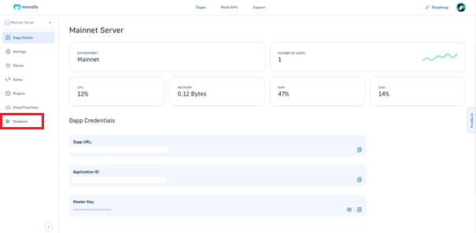
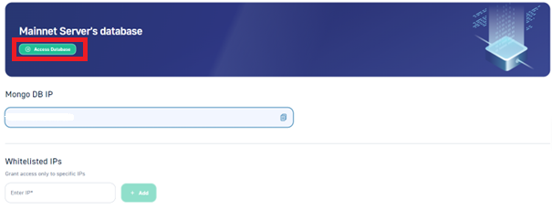
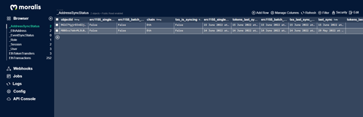

# 🍦 Connect with Vanilla JS


Make sure to create your own server before beginning this guide - [**Create a Moralis Dapp**](../getting-started/create-a-moralis-dapp.md)



<mark style="color:green;">**Check out the live code here:**</mark> [**Working Code**](connect-with-js.md#working-code)


### Adding Moralis to Your Web Page using Javascript

### 1. Create an empty page

The first step is to create an empty page we call `index.html` and `main.js` in the same directory and import the **moralis** script alongside our `main.js` file. We include two buttons on the page - one for logging in and one for logging out.


```html
<!DOCTYPE html>
<html>
  <head>
    <title>Vanilla Boilerplate</title>
    <script src="https://unpkg.com/moralis/dist/moralis.js"></script>
  </head>

  <body>
    <h1>Moralis Hello World!</h1>

    <button id="btn-login">Moralis Metamask Login</button>
    <button id="btn-logout">Logout</button>

    <script type="text/javascript" src="./main.js"></script>
  </body>
</html>
```



The above example imports the **latest** version of Moralis. When running your code in production, It's always better to specify a version in this way:

_**https://unpkg.com/moralis@\<VERSION>/dist/moralis.js**_

For the latest release version, you can check the [Releases on GitHub](https://github.com/MoralisWeb3/Moralis-JS-SDK/releases). For example:

_**\<script src="https://unpkg.com/moralis@1.0.3/dist/moralis.js">\</script>**_


### 2. Initialize the SDK


Initialize your server using **`Moralis.start()`** function



```javascript
/* Moralis init code */
const serverUrl = "https://xxxxx/server";
const appId = "YOUR_APP_ID";
Moralis.start({ serverUrl, appId });

/* TODO: Add Moralis Authentication code */
```


In order to initialize the SDK, you need to fetch _**Server (Dapp) URL**_ and _**APP ID**_ from your Moralis Dashboard. Go to your Moralis Server Details:


### 3. Add Authentication

Now that the SDK is successfully connected we can use the power of Moralis. Let's login a user and instantly get all their tokens, transactions and NFTs from all chains in your Moralis Database.


```javascript
/* Moralis init code */
const serverUrl = "https://xxxxx/server";
const appId = "YOUR_APP_ID";
Moralis.start({ serverUrl, appId });

/* Authentication code */
async function login() {
  let user = Moralis.User.current();
  if (!user) {
    user = await Moralis.authenticate({
      signingMessage: "Log in using Moralis",
    })
      .then(function (user) {
        console.log("logged in user:", user);
        console.log(user.get("ethAddress"));
      })
      .catch(function (error) {
        console.log(error);
      });
  }
}

async function logOut() {
  await Moralis.User.logOut();
  console.log("logged out");
}

document.getElementById("btn-login").onclick = login;
document.getElementById("btn-logout").onclick = logOut;
```


### 4. View the page from localhost

Run `index.html` on `localhost` as a web page. The easiest way is by using the [live server extension](https://marketplace.visualstudio.com/items?itemName=ritwickdey.LiveServer) Visual Studio Code. Just right click on `index.html` and select `Open with Live Server`.


### 5. Login with Metamask

Visit the webpage and click `Login`. Your Metamask will popup and ask you to sign in.


To connect other wallets other than MetaMask, check out: [**Web3 Authentication**](../users/web3-login.md)



### 6. See all User Assets in the Moralis Database

As soon as the user logs in Moralis fetches all the on-chain data about that user from all chains and puts it into the [**Moralis Database**](../database/). To see the Moralis Database go to your server and click on _**Dashboard**_.

<p align="center">
  
</p>

<p align="center">
  
</p>

<p align="center">
  
</p>


You will see the database of that server once you click _Dashboard_. Moralis fetches data from all blockchains where the address of the user has been active and you can see and query all tokens, NFTs and past transactions of the user all in one database.

### Working Code



### Move Assets

Try moving the assets in your MetaMask Wallet and observe how the Moralis Database will update the records in real-time.

### Tip of the iceberg

As you can probably already see Moralis is a true superpower for blockchain developers. But this small demo is just the tip of the iceberg. Moralis provides endless tools and features for any blockchain use case. Most importantly, everything is cross-chain by default.

Feel free to explore the rest of the documentation in order to grasp the full power of Moralis.

### Connecting via NPM

#### Install Moralis NPM Package

For larger projects use the [npm module](https://www.npmjs.com/moralis).

```
npm install moralis
```

Then include it in the JS file as usual.

```javascript
const Moralis = require("moralis");
```


For React Projects: Please follow the [Connect with React](connect-with-react.md) Guide

