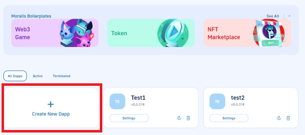
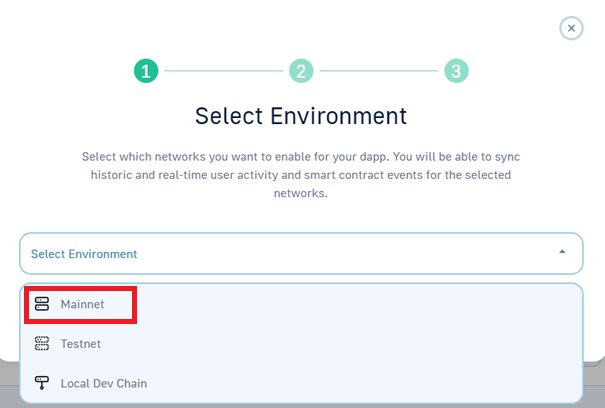
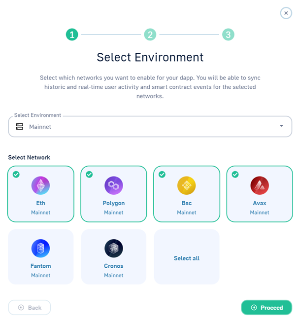
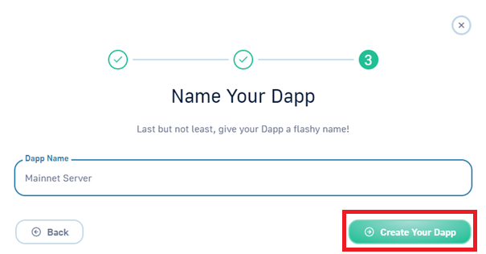
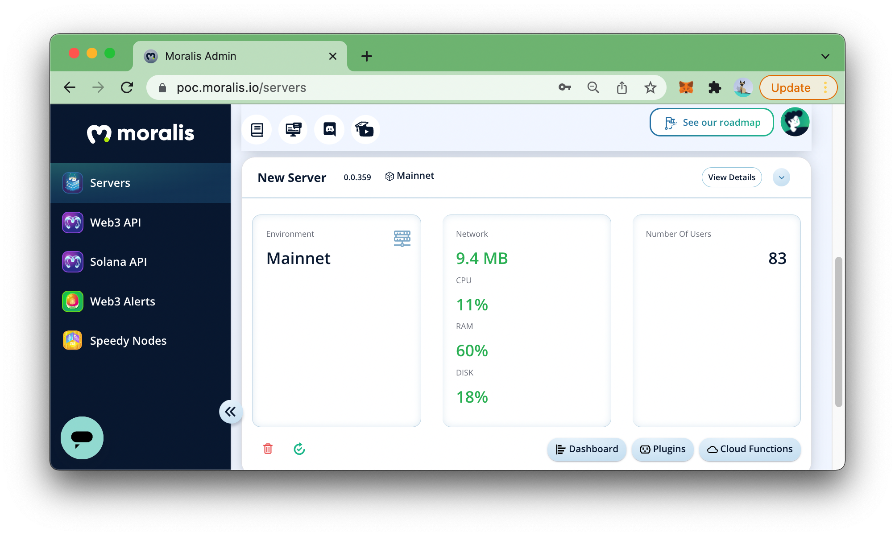
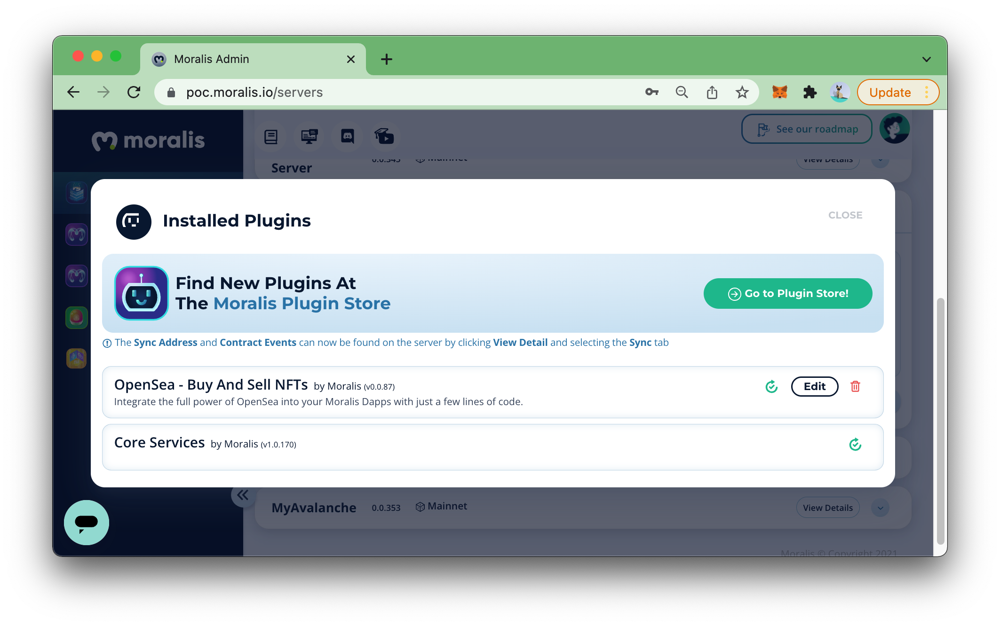

# 🚀 Create a Moralis Dapp

### What is a Moralis Dapp?

Each Dapp is usually divided into 2 parts:

1. **On-chain:** Smart Contracts, On-Chain Assets like tokens and NFTs, On-Chain transactions etc.
2. **Off-chain:** Backend infrastructure that collects data from the blockchain, offers an API to clients like web apps and mobile apps, indexes the blockchain, provides real-time alerts, coordinates events that are happening on different chains, handles the user life-cycle and so much more.

Moralis Dapp is used in order to speed up the implementation of the **off-chain infrastructure**. Moralis Dapp is a bundled solution of all the features most Dapps need in order to get going as soon as possible.

### 1. Create a free account

Go to [Moralis](https://moralis.io) and sign up for a free account.

### 2. Create a Moralis Server

Click **Create a new server** in the top right corner.

You can use Moralis to develop dApps for <mark style="color:green;">**mainnets, testnets**</mark> and <mark style="color:green;">**local devchains**</mark> (for example Hardhat and Ganache).

For now, please select **Mainnet Server**.

### 3. Set Up Desired Environment

For the purpose of this demo, we select Ethereum, Polygon, BSC and Avalanche.

 

 

 

### 4. Explore the Dapp Dashboard

Now you will see your server in your dashboard, and we can move on and create a web app that talks to the server and is able to login users, fetch user data (tokens, NFTs, historical transactions), and so much more! <mark style="color:green;">**All cross-chain by default, of course**</mark> 🤯

The server displays several important **indicators** as shown in the image above:

* `Network`: Network traffic per second
* `CPU`: Server's CPU Usage
* `RAM`: Server's RAM Usage
* `DISK`: Server's Disk Usage
* `Number of Users`: The number of users that have been authenticated in the server

### Migrate Dapp to Nitro Version

Every new Dapp created in Moralis now will be Nitro by default. However, those Dapps created before the launch of Moralis Nitro might still be using the legacy version. In order to upgrade the server to Nitro, simply install the coreservices plugin by clicking [here](https://legacy.moralis.io/install/plugin/coreservices). 


Keep in mind that once the coreservices plugin has been added, it can't be removed. This means that the migration from Legacy to Nitro will be **irreversible**. From your server, you can see `coreservices` as one of the plugins.



If you are in production and you have strict access rights to tables, then, coreservices role has to be added to CLP for some tables, for example for tables where event syncs are done. You can contact us in legacy to nitro migration channel in discord in case that you need assistance.



Note: This screenshot was taken while Moralis was still using Legacy UI!


Moralis Nitro Dapp has a number of breaking changes that are listed [here](https://forum.moralis.io/t/moralis-nitro-is-out/9267).


One <mark style="color:green;">**important**</mark> change when migrating from legacy to Nitro would be the removal of _**TokenBalance**_ and _**NFTOwners**_ tables from the database. This means once the Moralis Dapp has been migrated, these tables will disappear


To attain the same functionality, all queries to these tables should be replaced with some of our available [Web3APIs](../web3-sdk/) to do the same job:

* `TokenBalance` -> [`getTokenBalances`](https://docs.moralis.io/moralis-dapp/web3-sdk/account#gettokenbalances)
* `NFTOwners` -> [`getNFTOwners`](https://docs.moralis.io/moralis-dapp/web3-sdk/token#getnftowners)

### Tutorial


Note: UI in the videos might differ from the current UI



See this video if you want to understand the power of Moralis Server and how it can help you build cross-chain dApps.



If you prefer to follow a video tutorial - this video covers a lot of what's covered in this article.


####
