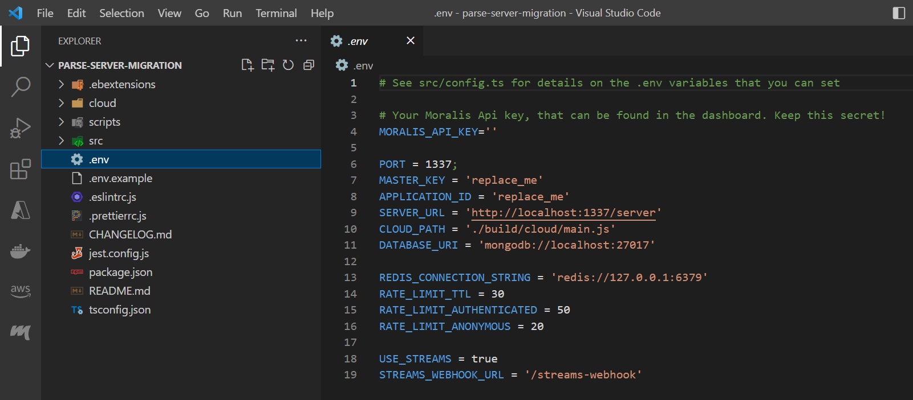



### Overview

This guide will teach you how to initially **set up your own Moralis Server** to then **run it locally**.





### More Info

Moralis Server is an extension of the [Parse Server](https://github.com/parse-community/parse-server).



## Prerequisites

- Have **Node.js** installed. Make sure the version you installed is [compatible with Parse Server](https://github.com/parse-community/parse-server#compatibility). Run `node --version` to check it. In most use-cases we recommend [`v16`](https://nodejs.org/en/blog/release/v16.14.2/).
- Have a package manager installed like `yarn` or `npm`. In this guide we will be using `yarn`.

## Get the sample project



To speed up the migration process, we have the [parse-server-migration](https://github.com/MoralisWeb3/Moralis-JS-SDK/tree/main/demos/parse-server-migration) project ready for you.





This project includes all the supported features, and will be updated once we release a new feature.



[**Download**](https://moralisweb3.github.io/Moralis-JS-SDK/downloads/parse-server-migration.zip) it and open it with your code editor:


## Install dependencies

Open the terminal and run:

```shell
yarn install
```

## Fill environment variables

To get the `.env` file, run:

```shell
cp .env.example .env
```

You will see something like this:



Next, we will go through the variables that you need to **fill/modify for this local setup**.



**Never expose** these values to the public. **Especially not the `MASTER_KEY`**, as it would give users access to the entire server.



### `MORALIS_API_KEY`

Get your API Key from your [Moralis dashboard](https://admin.moralis.io/web3apis).

### `MASTER_KEY`

It is required for Parse Server and can be any value to your choice. For example:

```shell
M4sT3RK3y
```

### `APPLICATION_ID`

It is required for Parse Server and can be any value to your choice. For example:

```shell
001
```

### `DATABASE_URI`



The **self-hosted Moralis Server** needs a **database to store all the data**. In this guide we will be using **MongoDB**, as this is also being used on the **Moralis-hosted server**. [See how you could also use **Postgres**](https://docs.parseplatform.org/parse-server/guide/#database).



For this local setup, you can use the [`mongodb-runner`](https://github.com/mongodb-js/runner) to **automatically create a database instance**.



Do not use this method in a production environment as it is only built for local development and testing.



`mongodb-runner` is already included in this project, so **to start an instance run**:

```shell
yarn dev:db-start
```

By default this will start a MongoDB on port `27017` so set `DATABASE_URI` to:

```shell
'mongodb://localhost:27017'
```

You can stop the instance with:

```shell
yarn dev:db-stop
```



Make sure to start the instance before running the server.



### `REDIS_CONNECTION_STRING`



Redis is needed to utilise the **rate-limit functionality**. For this we are using the [`RedisCacheAdpater`](https://docs.parseplatform.org/parse-server/guide/#rediscacheadapter) of Parse Server.





You can opt-out of this dependency if you want to set up your rate-limit functionality in any other way.



See this [complete guide](https://redis.io/docs/getting-started) on how to setup Redis locally. If you're on Windows we recommend following this [amazing YouTube tutorial](https://www.youtube.com/watch?v=_nFwPTHOMIY).

After running Redis locally, set `REDIS_CONNECTION_STRING` to its URL, which will probably be:

```shell
'redis://127.0.0.1:6379'
```

### Complete `.env`

Your `.env` file should look like this:

```shell
# See src/config.ts for details on the .env variables that you can set

# Your Moralis Api key, that can be found in the dashboard. Keep this secret!
MORALIS_API_KEY = '3ACGok8mCyMO42LRVMTclDQq5ljl8xEc7b2b5Tr6fDPrcQtYhnTI3VJBcsgVPLwG'

PORT = 1337;
MASTER_KEY = M4sT3RK3y
APPLICATION_ID = 001
SERVER_URL = 'http://localhost:1337/server'
CLOUD_PATH = './build/cloud/main.js'
DATABASE_URI = 'mongodb://localhost:27017'

REDIS_CONNECTION_STRING = 'redis://127.0.0.1:6379'
RATE_LIMIT_TTL = 30
RATE_LIMIT_AUTHENTICATED = 50
RATE_LIMIT_ANONYMOUS = 20

USE_STREAMS = true
STREAMS_WEBHOOK_URL = '/streams-webhook'
```

## Run the server locally

First, compile your code with:

```bash npm2yarn
npm run build
```



This will compile your code to `/build`. This step is required for cloud functions to work. Alternatively you can change the path to your cloud code in the `CLOUD_PATH` environment variable but we will see that in a more advanced section.



Now you can **run the server locally** with:

```bash npm2yarn
npm run start
```

Your server is compiled and running locally on your specified `PORT` (by default `http://localhost:1337`).



Now your server can be accessed on **[http://localhost:1337/server](http://localhost:1337/server)**





### Remember

With this local setup, the server is still **not production-ready**. Let's continue with the [next step](/web3-data-api/self-hosting-moralis-server/production-environment-setup) to make it so.


