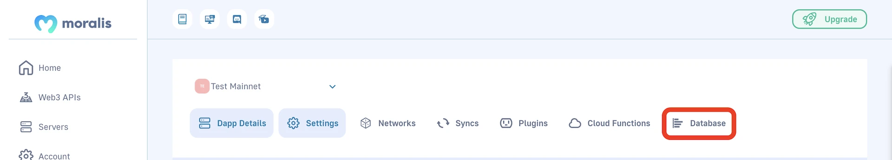



## Overview

This guide teaches you how to **migrate data** from your **Moralis-hosted MongoDB** to your **MongoDB Atlas solution**.





### Important

The completion of [**Production Environment Setup**](/web3-data-api/self-hosting-moralis-server/production-environment-setup) is **required** to continue.



## Whitelist your IP in Moralis

In order to access your MongoDB you need to whitelist your IP address:




## Connect directly to the hosted Moralis MongoDB

You can connect to the MongoDB that is hosted on Moralis via different methods:

- Using scripts
- Using the [MongoDB Compass tool](https://www.mongodb.com/products/compass)
- Using `mongodump` and `mongorestore`

### Using scripts

import Tabs from '@theme/Tabs';
import TabItem from '@theme/TabItem';

<Tabs>
  <TabItem value="nodejs" label="NodeJs" default>

```javascript NodeJs
const { MongoClient } = require("mongodb");

const MONGO_HOST = "MONGO_HOST_IP_FROM_ADMIN_INTERFACE";
const MONGO_PORT = "MONGO_HOST_PORT_FROM_ADMIN_INTERFACE";

// Create a new MongoClient
const client = new MongoClient(`mongodb://${MONGO_HOST}:${MONGO_PORT}`);

async function run() {
  try {
    // Connect the client to the server
    await client.connect();
    // Establish and verify connection
    await client.db("admin").command({ ping: 1 });
    console.log("Connected successfully to server");
  } finally {
    // Ensures that the client will close when you finish/error
    await client.close();
  }
}
run().catch(console.dir);
```

  </TabItem>
  <TabItem value="python" label="Python">

```python Python
import pprint
import pymongo

MONGO_HOST = "MONGO_HOST_IP_FROM_ADMIN_INTERFACE"
MONGO_PORT = MONGO_HOST_PORT_FROM_ADMMIN_INTERFACE

con = pymongo.MongoClient(MONGO_HOST, MONGO_PORT)
user_table = con['parse']['_User']
pprint.pprint(user_table.find_one())
```

  </TabItem>
</Tabs>

After you have established direct access to Mongo DB, you You can do your own dumps for the database.



\_User table is a particular example of table that starts with \_, most of the tables will not start with \_



### Using Compass

You can use Compass to interact with MongoDB using a tool with an interface.


Now you are connected to the MongoDB that is hosted on Moralis. For reference on how to export data, see <https://www.mongodb.com/docs/compass/current/import-export/>.

### Using mongodump and mongorestore

`mongodump` and `mongorestore` are command line tools you can use to perform a full database migration from your hosted server to your self-hosted server.

1. Install [MongoDB Database Tools](https://www.mongodb.com/try/download/database-tools). You can read the instructions specific to your OS [here](https://www.mongodb.com/docs/database-tools/installation/installation/).
2. Run the following command to dump your hosted server's database:

```shell
mongodump mongodb://ipaddress:port --db=parse
```

You should have a folder called `dump` with a folder called `parse` inside it.

3. Change the terminal's directory to `dump`.
4. Run the following command to migrate the data to your new MongoDB database - this will copy the data from the `parse` folder to a database called `parse` (`/parse`):

```shell
mongorestore mongodb+srv://username:password@***.mongodb.net/parse parse
```

## Import data

To import data, you can use the same methods as in the previous step. You can use a script, or connect via Compass, or use mongorestore. The difference is that you will need to provide the `DATABASE_URI` of your server that you have specified in your `.env`.
