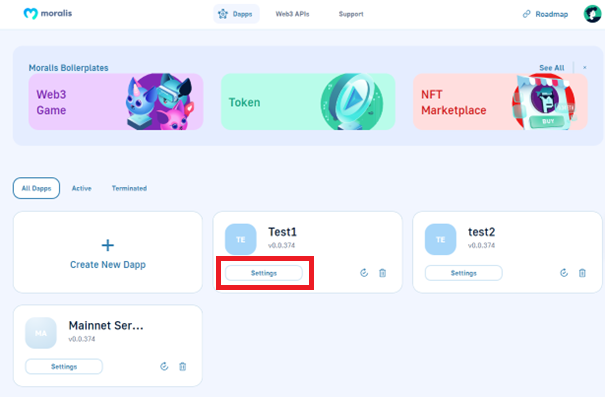
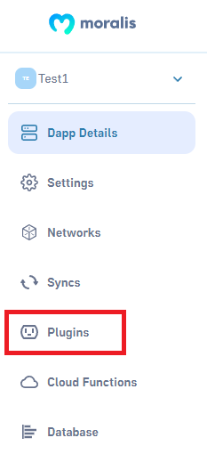

# Install and Remove Plugins

## Open Plugin List 

Each Moralis Server instance has its own set of plugins which are managed separately. Expand the server view and click on the "Plugins" button.​

  

  

This will bring up the list of plugins. The "Installed" tab will list the currently installed plugins, where the "Browse" tab lists all available plugins.‌

## Plugin List 

Here you can find the plugins already installed. If you want to install plugins click the "Go to Plugin Store!" button.

Already installed plugins will have an "Installed" badge.‌

## Moralis Plugin Store

In the Moralis Plugin Store, you can find a bunch of plugins that will make your dApp development easier. This tab provides information about the plugin author, its purpose and rating.

.png>)

If you want to know more details about the plugin or install it click on the "Read More" button.

## Plugin Description and Installing

On this tab, you can read a detailed description of the plugin and instructions for installing it.

.png>)

.png>)

If you want to add a plugin to your server click the "Install the plugin" button.

## Plugin Installing

After clicking the "Install the plugin" button, you will see the "Install Plugin" modal window. You need to select the server to which you want to add the plugin.

## Fiat Plugin Installing

After you choose the server to install the plugin on. You will need to provide "The Onramper API key". You can get it on the [https://onramper.com/](https://onramper.com) website.

After the plugin installation is finished, your server will automatically reboot:

And you will see the plugin in your Plugins tab:

After installing the plugin you can start using it with the following code:

`Moralis.Plugins.fiat.buy()`

This will open up a new browser window and guide the user through the steps to purchase cryptocurrencies.

## Removing Plugins 

Go to the Plugins tab. Scroll down the list until you find the plugin you want to remove and press the "Garbage Can" button.​

