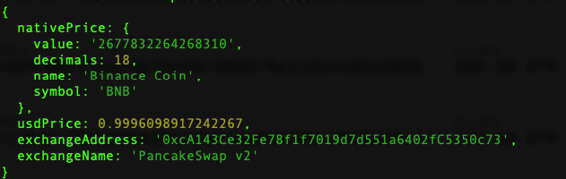
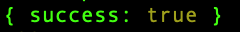

# 🖨 Connect using Node.js

### Installing Moralis SDK

Run the following command to install Moralis SDK

```
npm install moralis
```

### SDK Initialization

Create a folder `moralis-node-app` and a file `index.ts` inside it.

You need to initialize Moralis SDK with the following syntax in node.js:

```javascript
  /* Moralis init code */
const serverUrl = "YOUR-SERVER-URL";
const appId = "YOUR-APP-ID";
const masterKey = "YOUR-MASTER-KEY";

await Moralis.start({ serverUrl, appId, masterKey });

```
with `masterKey` you can directly access the moralis dashbaord without the need for authentication.

**Note: With master key you can use the API, RPC nodes and other features of your moralis account using the SDK straight from your backend.**

**Please remember to never leak your master key because once someone gets your master key they will have full access to your moralis account**

### DB query

#### Saving data

To save object with data copy paste the following code:

```javascript
    await Moralis.start({ serverUrl, appId, masterKey, moralisSecret })
    
    const Monster = Moralis.Object.extend("Monster");
    const monster = new Monster();

    monster.set("strength", 1024);
    monster.set("ownerName", "Aegon");
    monster.set("canFly", true);

    await monster.save()
```

Run the following command in your terminal:

```
npx ts-node index.ts
```

Go to your moralis dashboard and you will see the data saved in the database:


#### Query

```javascript
    const Monster = Moralis.Object.extend("Monster");
    const query = new Moralis.Query("Monster");
    
    const results = await query.find();
    console.log(results);
```

Run:

```
npx ts-node index.ts
```

In your console you will see:


For more info on DB Queries click [here](https://docs.moralis.io/moralis-server/database/queries)

### Live Query

Subscribing to Queries to Get Real-Time Alerts Whenever Data in the Query Result Set Changes.

add the following code in your file:

```javascript
    const Monster = Moralis.Object.extend("Monster");
    const query = new Moralis.Query(Monster);

    let subscription = await query.subscribe();
    console.log(subscription);

```
Run:

```
npx ts-node index.ts
```

In your console you will see:


For more info on Live Queries click [here](https://docs.moralis.io/moralis-server/database/live-queries)


### Web3API use


```javascript
const serverUrl = "YOUR-SERVER-URL";
const appId = "YOUR-APP-ID";
const moralisSecret = "YOUR MORALIS SECRET";

await Moralis.start({ serverUrl, appId, moralisSecret });

    //calling `getTokenPrice({address:"tokenAddress", chain:"chainID"})` from web3API
    const price = await Moralis.Web3API.token.getTokenPrice(
    {address: "0xe9e7cea3dedca5984780bafc599bd69add087d56", chain: "bsc"})
    console.log(price);
}

```

with `moralisSecret` all API calls go directly to the API instead of passing through the Moralis Server.

To get `moralisSecret` you need to go to account settings as shown in image below


then API and copy your `moralisSecret` key


Run:

```
npx ts-node index.ts
```

You will see the following result:


### Enable Moralis with Private key

#### `Moralis.Transfer`

We can transfer using private key in the backend any `'native' | 'erc20' | 'erc721' | 'erc1155'` tokens.

```javascript
const tranx = async () => {
    
    await Moralis.start({ serverUrl, appId, moralisSecret })

    // Enable web3
    await Moralis.enableWeb3({
        //BSC mainnet
        chainId: 0x38,
        privateKey: "YOUR-PRIVATE KEY",
    });

    // sending 0.5 DAI tokens with 18 decimals on BSC mainnet
    const options: Moralis.TransferOptions = {
            type: "erc20", 
            amount: Moralis.Units.Token("0.5", 18),
            receiver: "0x93905fd3f9b8732015f2b3Ca6c16Cbcb60ECf895",
            contractAddress: "0x1AF3F329e8BE154074D8769D1FFa4eE058B1DBc3",
        };
    await Moralis.transfer(options)
        .then((result) => {
            console.log(result);
    });
}

tranx();
```

Note: Private key should never be exposed to front-end or browser or on cloud orelse will result in loss of funds

Run:

```
npx ts-node index.ts
```

You will see the `result` in your terminal:


#### `Moralis.executeFunction`

```javascript
const execute = async () => {
  
        await Moralis.start({ serverUrl, appId, moralisSecret })
        
        // Enable web3
        await Moralis.enableWeb3({
            chainId: 0x1,
            privateKey:
            "afcf6a8d1a2b9e20bd322850afb28085693f436427fe8da3d0e40954cfb2d0dc",
        });

        const options = {
            // CAPSULE contract
            contractAddress: '0xfcb1315c4273954f74cb16d5b663dbf479eec62e',
            // calling tokenURI function
            functionName: 'tokenURI',
            // contract ABI
            abi: [{"inputs":[{"internalType":"uint256","name":"tokenId","type":"uint256"}],"name":"tokenURI","outputs":[{"internalType":"string","name":"","type":"string"}],"stateMutability":"view","type":"function"}],
            // token URI of token ID 700
            params: { tokenId: 700 }
        };
        await Moralis.executeFunction(options)
        .then((result) => {
            console.log(result);
        });
};

execute();
```

Run:

```
npx ts-node index.ts
```


You will see the `result` in your terminal:


For more info on `executeFunction` check [here](https://docs.moralis.io/moralis-server/web3/web3#executefunction)




### Add New Address Sync From Code

The `Sync and Watch Address` plugin calls a Cloud Function called watchXxxAddressunder the hood, where "Xxx" are the chain names [here](https://docs.moralis.io/moralis-server/automatic-transaction-sync/historical-transactions#chain-prefixes). These cloud functions can also be called directly from your own code!

Add below code to your `index.ts` file in node application:

```javascript
const watchAddr = async () => {
  
    await Moralis.start({ serverUrl, appId, masterKey })

    await Moralis.Cloud.run("watchBscAddress", {address: "0x..."},{ useMasterKey: true })
        .then((result) => {
        console.log(result);
        });
    }

watchAddr();

```


Run:

```
npx ts-node index.ts
```

in Terminal you will see:


The transaction data is stored in Moralis Dashboard:


By default, only new transactions made by addresses being watched by using this cloud function will be added to the database. If you also want to add historical data for addresses that you want to watch, you can add `sync_historical:true`

Note: The watch address functions return no value as they start a job. They are still asynchronous though! Once the promise returns the synced transactions, they should be in the XxxTransactions table for the corresponding chain.


### Add New Event Sync From Code

#### Watch new smart contract event

Moralis Server has a special cloud function called `watchContractEvent(options)`. You can call it using the master key.
Note: limit parameter is available only for Nitro servers (those one that have coreservices plugin). If limit parameter is not provided then the default value is 500000.
Note: at the moment the events created via code won't be seen in the admin UI, you can only see them in the database, we are working on connecting the admin UI properly


```javascript
const watchEvent = async () => {
  await Moralis.start({ serverUrl, appId, masterKey })
    // code example of creating a sync event from cloud code
    let options = {
      "chainId": "42",
      // UniswapV2Factory contract
      "address": "0x5c69bee701ef814a2b6a3edd4b1652cb9cc5aa6f",
      "topic": "PairCreated(address, address, address, uint256)",
      "abi":   {
        "anonymous": false,
        "inputs": [
          { "indexed": true, "internalType": "address", "name": "token0", "type": "address" },
          { "indexed": true, "internalType": "address", "name": "token1", "type": "address" },
          { "indexed": false, "internalType": "address", "name": "pair", "type": "address" },
          { "indexed": false, "internalType": "uint256", "name": "test", "type": "uint256" }
        ],
        "name": "PairCreated",
        "type": "event"
      },
      "limit": 500000,
      "tableName": "UniPairCreated",
      "sync_historical": false
    }

    Moralis.Cloud.run("watchContractEvent", options, {useMasterKey:true})
      .then((result) => {
      console.log(result);
      })
  }

watchEvent();
```

Run:

```
npx ts-node index.ts
```

In terminal you will see:



The Event data is stored in Moralis Dashboard:


##

##
