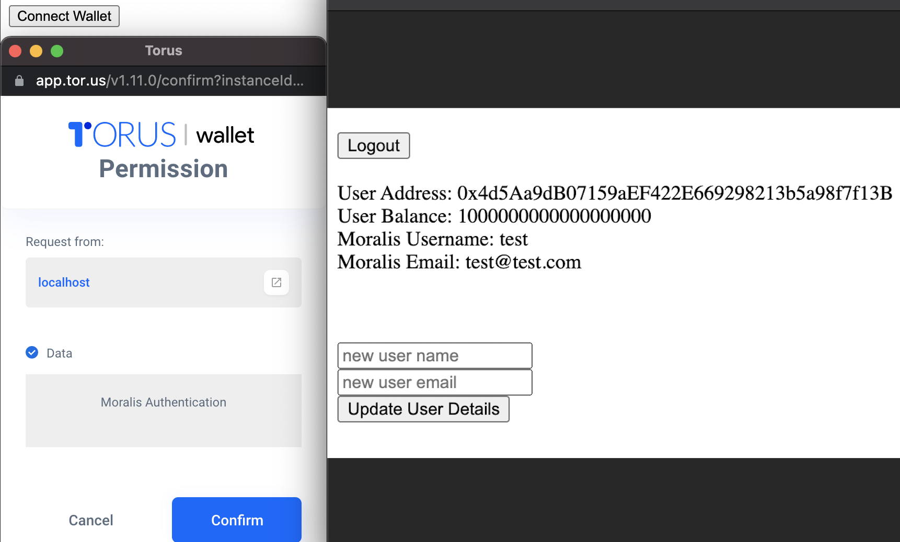

# Crypto Login

## Moralis Authentication

Moralis allows you to authenticate users on any blockchain with just one line of code. All assets, tokens, and NFTs of your users are automatically synced into your Moralis database and are updated in real-time as your users make on-chain transactions.

## Ethereum, BSC, and Polygon Login

### MetaMask

Authenticating users is simple:

```javascript
Moralis.authenticate().then(function (user) {
    console.log(user.get('ethAddress'))
})
```

This will connect [MetaMask](https://metamask.io) and request a signature (no gas required!).

We use the signature as proof the user is owner of account, if no signature is provided, anyone can gain the credentials necessary to read /write to users private data in Moralis Database. The signing is no different than entering a username and password. If a user wants to use the authenticated features of an app they need to “log in”. They choose when to do so by pressing the “login” button.

.png>)

It works the same way for all Ethereum Virtual Machine (EVM) compatible chains such as Binance Smart Chain and Polygon (Matic), as they all share the same Ethereum addresses.

As soon as the user is logged in all their assets, tokens, NFTs and past transactions are instantly synced into your Moralis Database. The database updates if the users are moving assets on-chain.

 (1) (1).png>)


Logging in your first users on Ethereum, Polygon, Avalanche (or any other chain) using Moralis.


### WalletConnect


Practical Demo how to login your users to you dapp with any wallet.


Moralis also supports authentication using WalletConnect. First add the provider by adding the script (make sure to use the latest version, see [https://github.com/WalletConnect/walletconnect-monorepo/releases](https://github.com/WalletConnect/walletconnect-monorepo/releases)):

```javascript
<script src="https://github.com/WalletConnect/walletconnect-monorepo/releases/download/1.6.2/web3-provider.min.js"></script>
```

Or install the `@walletconnect/web3-provider` package when you use npm (or another package manager):

```bash
npm install @walletconnect/web3-provider
```

Then call authenticate like above, but with a provider option:

```javascript
const user = await Moralis.authenticate({ provider: "walletconnect" })
```

#### Specify the `chainId`.

You might want to specify the chain id that WalletConnect will use by default. You can do this by providing the `chainId` as an extra option:&#x20;

```javascript
const user = await Moralis.authenticate({ provider: "walletconnect", chainId: 56 })
```

#### Filter Mobile Linking Options&#x20;

If you would like to reduce the number of mobile linking options or customize its order, you can provide an array of wallet names to the `mobileLinks` option .&#x20;

```javascript
const user = await Moralis.authenticate({ 
    provider: "walletconnect", 
    mobileLinks: [
      "rainbow",
      "metamask",
      "argent",
      "trust",
      "imtoken",
      "pillar",
    ] 
})
```

### Custom Wallet Login

Although Moralis offers native support for MetaMask and WalletConnect, it's possible to use any Web3 provider. The scope of this guide is to demonstrate how to supply any provider.

This guide will use `Tourus` and Binance Smart Chain. The `Tourus` documentation is available at this url: [https://docs.tor.us/](https://docs.tor.us).

The `Moralis` class has a method called `enable`. The first step is to overwrite this method in order to use a custom `Moralis wallet provider` class.

**Import the Provider**

```javascript
<script src="https://cdn.jsdelivr.net/npm/@toruslabs/torus-embed"></script>
```

**Create the Torus Provider**

```javascript
class MoralisTorusProvider {

    torus = new Torus({})
    
    async activate() {

        this.provider = await this.torus.init(
            {
                enableLogging: true,
                network: {
                    host: "<YOUR BINANCE SPEEDY NODE>",
                    networkName: "Smart Chain - Testnet",
                    chainId: 97,
                    blockExplorer: "https://testnet.bscscan.com",
                    ticker: 'BNB',
                    tickerName: 'BNB',
                },
            })
        await this.torus.login();
        
        const MWeb3 = typeof Web3 === 'function' ? Web3 : window.Web3;
        this.web3 = new MWeb3(this.torus.provider);
        this.isActivated = true;

        return this.web3;
    }
}
```

**Create a custom "enable" function**

```javascript
const customEnable = async () => {
    const web3Provider = new MoralisTorusProvider();
    const web3 = await web3Provider.activate();
    return web3;
}
```

Set `customEnable` as provider

```javascript
Moralis.setEnableWeb3(customEnable )
```

You are good to go, you can now enable Moralis and connect to Web3 by:

```javascript
window.web3 = await Moralis.enableWeb3();
```




## Non-EVM Chain Login

Authenticating with non-Ethereum Virtual Machine (EVM) compatible chains requires a bit more setup.

### Elrond

**Prerequisites**: In order to log in with Elrond, you'll need a ledger that can be purchased [here](https://www.ledger.com). Once you have a ledger, follow the steps in the [Elrond Ledger documentation](https://docs.elrond.com/wallet/ledger/) to add the Elrond app to the device.

Once the above steps are completed, we can continue with the actual authentication process.

If using the CDN, you must add the "[erdjs](https://docs.elrond.com)" script to your `<head>`.

```javascript
<script src="https://npmcdn.com/@elrondnetwork/erdjs@4.0.3/out-browser/erdjs.js"></script>
```

Now that all dependencies are in place we can authenticate:

```javascript
Moralis.authenticate({ type: 'erd' }).then(function (user) {
    console.log(user.get('erdAddress'))
})
```

**Important**: Notice the prefix of the address has changed from `eth` to `erd`.



## User Object

After the signature is completed the promise will resolve with a `User` object. The shape of the created user looks like this:&#x20;

```javascript
{
  className: "_User"
  id: String
  _objCount: 0
  attributes: {
    accounts: Array,
    ACL: Object,
    authData: Object,
    createdAt: Date,
    email: String, // empty
    ethAddress: String,
    sessionToken: String, 
    updatedAT: Date,
    username: String, // random value
  }
}
```

For new users, the `username` will be a randomly generated alphanumeric string and the `email` property will not exist. This can be set or changed by the app. See the "[Objects](../database/objects.md#saving-objects)" and "[Intro](https://docs.moralis.io/users/intro)" docs.

It will also create a new entry in the `Moralis._EthAddress` class, corresponding to the Ethereum address used for this user. The schema of the created entry in the `Moralis._EthAddress` object looks like this:&#x20;

```javascript
{
    "objectId": String,
    "transactions_synced": Number,
    "ACL": ACL,
    "last_eth_sync": Date,
    "data": String,
    "user": Pointer <_User>,
    "updatedAt": Date,
    "is_syncing": Boolean,
    "last_eth_sync_completed": Date,
    "signature": String,
    "last_eth_sync_block": Number,
    "transactions_total": Number,
    "createdAt": Date,
    "last_eth_sync_error": String
}
```

### Chain Specific User Properties

If you enable syncing data from chains other than Ethereum, additional user properties will be created. These will be prefixed with the chain. As an example, for Binance Smart Chain, the prefix is `bsc`. There will be an additional set of properties for each chain.

* `User.bscAddress` (String).
* `User.bscAccounts` (Array).

It's the same for chain-specific class tables on the Moralis Server. An additional set of classes will be created with the corresponding chain prefixes.

* BscTransactions
* BscTokenBalance
* BscTokenTransfers
* BscNFTOwners
* BscNFTTransfers

### Chain Prefixes

| Chain                                             | Prefix    |
| ------------------------------------------------- | --------- |
| Ethereum Mainnet, Ropsten, Goerli, Rinkeby, Kovan | `Eth`     |
| Binance Smart Chain Mainnet, Testnet              | `Bsc`     |
| Polygon (Matic) Mainnet, Mumbai Testnet           | `Polygon` |
| Elrond                                            | `Erd`     |

### Manually Deleting Users

During testing, if you manually delete a user, then make sure to delete the corresponding rows in the following collections (where "xxx" is the chain prefix). Not doing so may cause unexpected behavior when authenticating via Web3 from the address that was just deleted.

* Session
* xxxBalance
* \_xxxAddress

## Changing Sign-In Message

The message the user sees when signing in with Web3 can be changed by doing the following in the browser:

```javascript
Moralis.authenticate({signingMessage:"hello"})
```

.png>)

## Changing App Icon in MetaMask

It's possible to change the icon a user sees when interacting with your smart contract. To accomplish this, you'll have to add a favicon to your dApp. Follow the instructions in the [MetaMask docs](https://docs.metamask.io/guide/defining-your-icon.html).
