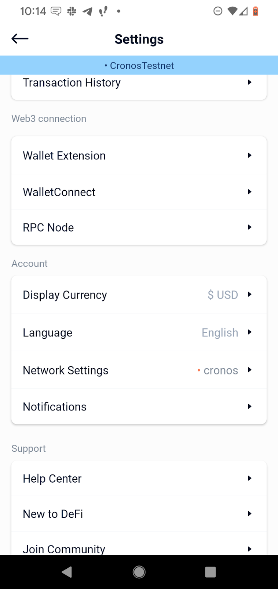
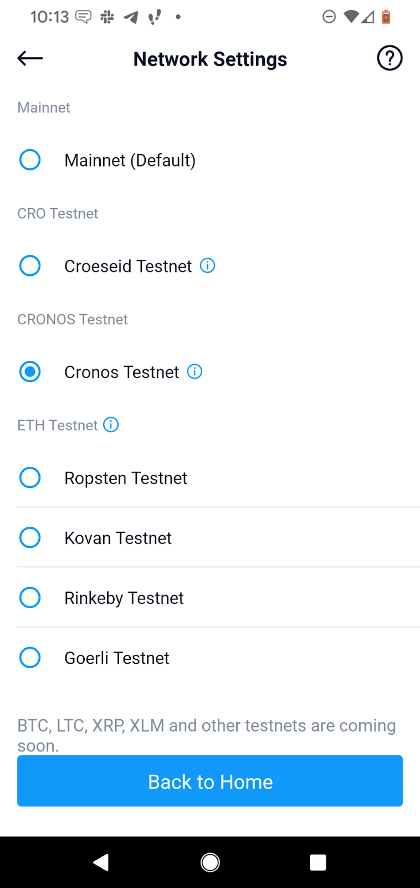
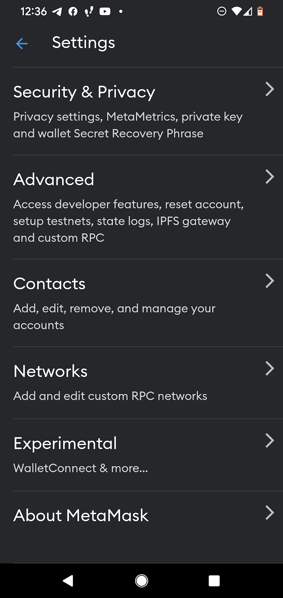
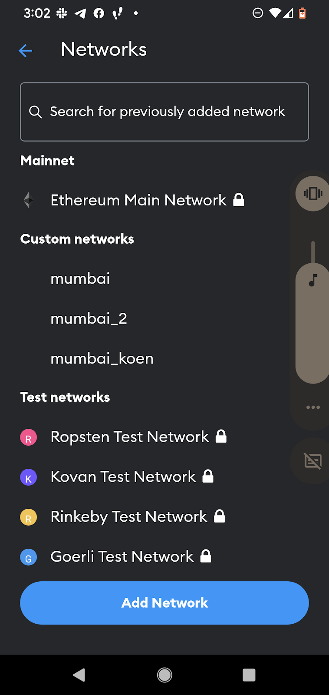
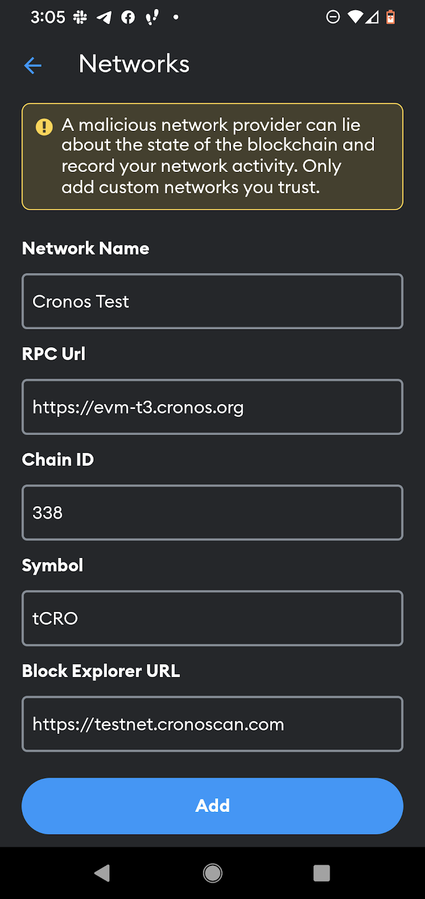

# Setup Cronos Testnet in Defi Wallet

1. In Cronos Defi Wallet go to Settings and select Network Settings

2. Click on Cronos Testnet

3. Click on “Back to Home”

# Setup Cronos Test in Metamask

**Use this information to define the network**
**Name**: Cronos testnet
**New RPC URL**: https://evm-t3.cronos.org for
**Chain ID**:338
**Symbol**:tCRO
**Block explorer URL**: https://testnet.cronoscan.com/

To create a network connection in Metamask

1. In Metamask go to Settings

2. Select Network

3. Select Add Network and Custom Network. Enter the chain network information (see above)

4. Click “Add”

